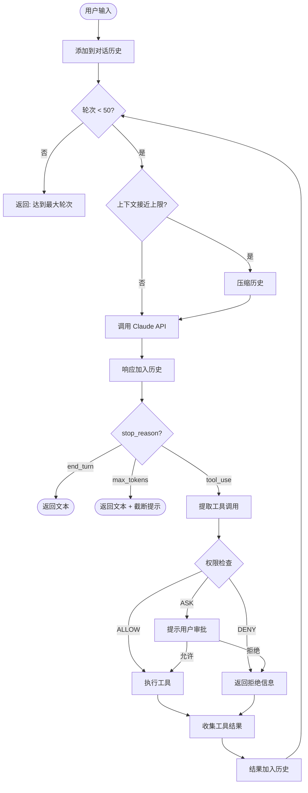

# Agent Loop 核心循环

Agent Loop 是 claude-code-java 最核心的设计。理解它，就理解了整个系统。

## 从生活类比开始

想象你是一个老板，给实习生布置了一个任务："帮我调研一下竞品的定价策略"。

实习生的工作流程：
1. **思考**：我需要先知道有哪些竞品 → 决定上网搜索
2. **行动**：搜索竞品列表
3. **观察**：得到 5 个竞品名称
4. **再思考**：现在需要查每个竞品的定价页面 → 决定逐个访问
5. **行动**：访问第一个竞品的官网
6. **观察**：找到了定价信息
7. ...重复...
8. **最终汇报**：整理所有信息，提交给老板

Agent Loop 就是这个流程的代码实现 —— LLM 就是那个实习生，**工具**就是它的搜索引擎和浏览器。

## 伪代码抽象

```
function agentLoop(userInput):
    messages.add(userInput)

    while (轮次 < 50):                    // 防止无限循环
        if (token接近上限):
            压缩历史()

        response = callClaudeAPI(messages)  // 让 Claude "思考"
        messages.add(response)

        switch (response.stop_reason):
            case "end_turn":               // Claude 认为任务完成
                return response.text

            case "tool_use":               // Claude 想用工具
                for each tool_call in response:
                    if (权限检查通过):
                        result = 执行工具(tool_call)
                    else:
                        result = "权限被拒绝"
                    messages.add(result)
                continue                   // 回到循环开头

            case "max_tokens":             // 输出被截断
                return response.text + "[截断]"

    return "达到最大轮次限制"
```

## stop_reason：循环的决策点

`stop_reason` 是 Claude API 返回的关键字段，它决定了 Agent Loop 的下一步行为：

| stop_reason | 含义 | AgentLoop 行为 |
|-------------|------|---------------|
| `end_turn` | Claude 认为任务完成 | 退出循环，返回文本 |
| `tool_use` | Claude 想要调用工具 | 执行工具，结果回传，继续循环 |
| `max_tokens` | 输出达到 token 上限 | 退出循环，提示截断 |
| `stop_sequence` | 遇到停止序列 | 退出循环 |



## 一个完整的执行轨迹

用户说："查看 src 目录有哪些 Java 文件，然后读取 AgentLoop.java"

**第 1 轮循环：**
```
→ Claude 思考："用户想看目录结构，我应该用 Glob 工具"
→ 返回: tool_use(Glob, {pattern: "src/**/*.java"})
→ stop_reason = "tool_use"
→ 执行 GlobTool → 返回文件列表
→ 结果追加到历史
```

**第 2 轮循环：**
```
→ Claude 思考："找到了文件列表，用户还想读 AgentLoop.java"
→ 返回: tool_use(Read, {file_path: "src/.../AgentLoop.java"})
→ stop_reason = "tool_use"
→ 执行 ReadFileTool → 返回文件内容
→ 结果追加到历史
```

**第 3 轮循环：**
```
→ Claude 思考："我已经有了所有信息，可以给用户总结了"
→ 返回: "src 目录下有 28 个 Java 文件... AgentLoop.java 的核心逻辑是..."
→ stop_reason = "end_turn"
→ 退出循环，返回文本
```

## 安全机制：MAX_TURNS

```java
private static final int MAX_TURNS = 50;
```

这是一个**安全阀** —— 防止 Agent Loop 无限循环。如果 Claude 持续返回 `tool_use` 超过 50 轮，系统强制退出。

::: warning 为什么需要这个限制？
LLM 是不确定的系统。理论上，Claude 可能进入一个"反复调用工具但无法完成任务"的死循环。MAX_TURNS 确保这种情况下系统不会永远挂起。
:::

## 上下文窗口检查

每轮循环开始前，会检查对话历史是否接近 200K token 的上下文窗口限制：

```java
if (contextManager.isNearLimit(history)) {
    contextManager.compact(history);
}
```

如果已用 token 超过 80%，触发压缩 —— 保留第一条消息和最近 10 轮对话，丢弃中间历史。

## 思考题

1. 如果 Claude 返回一个你不认识的 `stop_reason`（比如 `"new_type"`），当前代码会怎么处理？
2. 修改 `MAX_TURNS` 为 3，设计一个需要超过 3 轮工具调用的场景，观察系统行为
3. 当前 `executeTools()` 是串行执行工具的。如果改为并行，需要注意什么问题？

## 下一步

理解了 Agent Loop 的整体设计后，让我们看看它调用的 [API 通信层](/architecture/api-layer) 是如何工作的。
