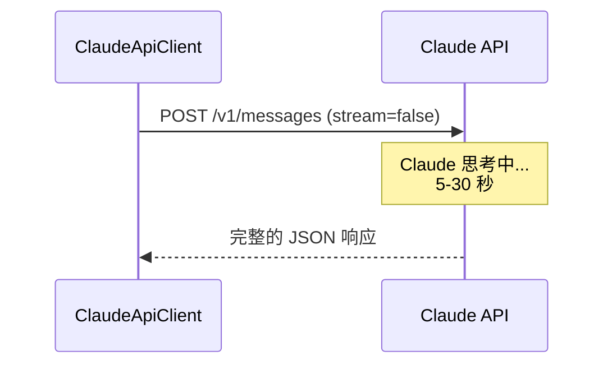
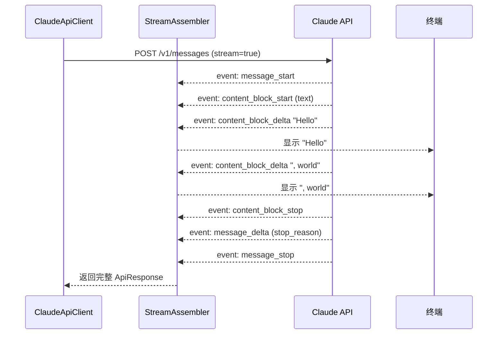

# API 通信层

API 通信层负责 claude-code-java 与 Claude API 之间的所有 HTTP 交互。

## Claude Messages API 概览

Claude 提供的是一个消息 API（Messages API），核心端点：

```
POST https://api.anthropic.com/v1/messages
```

### 请求头

每个请求必须携带三个请求头：

```http
x-api-key: sk-ant-api03-xxxxx        # API 密钥
anthropic-version: 2023-06-01         # API 版本号
content-type: application/json         # JSON 格式
```

### 请求体结构

```json
{
  "model": "claude-sonnet-4-6",
  "max_tokens": 8192,
  "system": "你是一个代码助手...",
  "stream": true,
  "tools": [
    {
      "name": "Read",
      "description": "读取文件内容...",
      "input_schema": { "type": "object", "properties": { ... } }
    }
  ],
  "messages": [
    { "role": "user", "content": "帮我读取 pom.xml" },
    { "role": "assistant", "content": [...] },
    { "role": "user", "content": [...] }
  ]
}
```

## 两种调用模式

### 非流式调用



特点：简单，但用户要等很久才能看到结果。

### 流式调用（SSE）



特点：用户 **实时** 看到文字逐字出现，体验好。这就是 ChatGPT/Claude 网页版的 "打字机效果"。

## SSE 事件流详解

SSE（Server-Sent Events）是一种 HTTP 长连接技术。服务器通过一条连接持续推送事件。

一个完整的 SSE 事件流示例：

```
event: message_start
data: {"type":"message_start","message":{"id":"msg_xxx","model":"claude-sonnet-4-6","role":"assistant"}}

event: content_block_start
data: {"type":"content_block_start","index":0,"content_block":{"type":"text","text":""}}

event: content_block_delta
data: {"type":"content_block_delta","delta":{"type":"text_delta","text":"好的"}}

event: content_block_delta
data: {"type":"content_block_delta","delta":{"type":"text_delta","text":"，让我"}}

event: content_block_delta
data: {"type":"content_block_delta","delta":{"type":"text_delta","text":"读取文件。"}}

event: content_block_stop
data: {"type":"content_block_stop","index":0}

event: content_block_start
data: {"type":"content_block_start","index":1,"content_block":{"type":"tool_use","id":"toolu_xxx","name":"Read","input":{}}}

event: content_block_delta
data: {"type":"content_block_delta","delta":{"type":"input_json_delta","partial_json":"{\"file"}}

event: content_block_delta
data: {"type":"content_block_delta","delta":{"type":"input_json_delta","partial_json":"_path\":\"/pom.xml\"}"}}

event: content_block_stop
data: {"type":"content_block_stop","index":1}

event: message_delta
data: {"type":"message_delta","delta":{"stop_reason":"tool_use"},"usage":{"output_tokens":42}}

event: message_stop
data: {"type":"message_stop"}
```

::: danger 关键陷阱
`input_json_delta` 发送的是 **不完整的 JSON 片段**！
`{"file` 和 `_path":"/pom.xml"}` 是分开到达的。
**绝对不能**在收到片段时尝试解析 —— 必须等 `content_block_stop` 后拼接完成才能解析。
:::

## HTTP 错误处理

| 状态码 | 含义 | 处理方式 |
|--------|------|---------|
| 200 | 成功 | 正常处理 |
| 401 | API Key 无效 | 提示检查 Key |
| 429 | 速率限制 | 指数退避重试（2s, 4s, 8s） |
| 500/502/503 | 服务端错误 | 提示稍后重试 |

429 限流重试机制：

```java
// 指数退避：2^1=2s, 2^2=4s, 2^3=8s
long waitSeconds = (long) Math.pow(2, retryCount);
Thread.sleep(waitSeconds * 1000);
```

## OkHttp 超时配置

```java
new OkHttpClient.Builder()
    .connectTimeout(30, TimeUnit.SECONDS)    // 连接超时
    .readTimeout(300, TimeUnit.SECONDS)      // 读取超时 5 分钟
    .writeTimeout(30, TimeUnit.SECONDS)      // 写入超时
    .build();
```

::: tip 为什么读取超时这么长？
Claude 处理复杂任务可能需要长时间 "思考"。如果设为 10 秒，长回复还没生成完就超时了。5 分钟足以覆盖绝大多数场景。
:::

## 思考题

1. 如果 `readTimeout` 设为 10 秒会发生什么？
2. 当前重试机制只处理 429 错误。还有哪些状态码值得重试？
3. 如何改进 `formatHttpError()` 让用户看到更友好的错误提示？

## 下一步

了解了 API 通信后，让我们看看 [权限管理](/architecture/permission) 是如何保障安全的。
