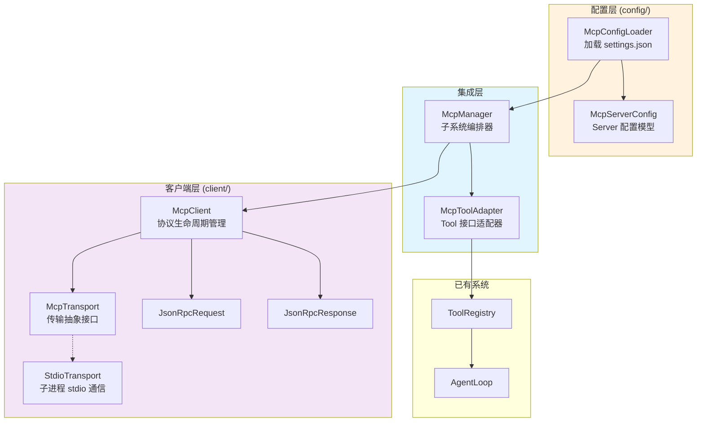
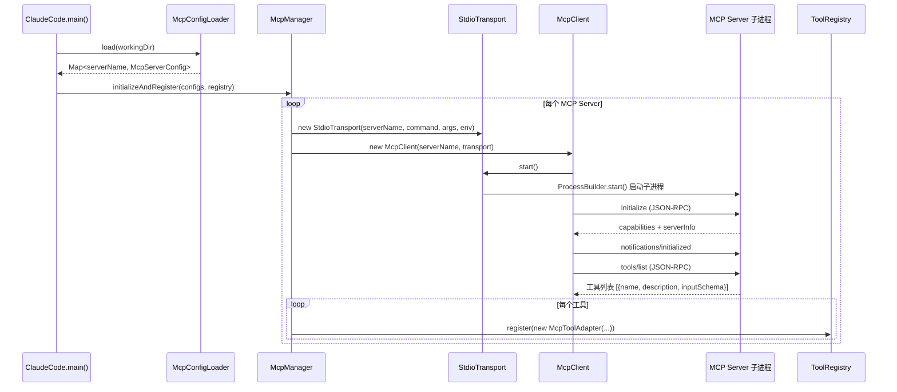
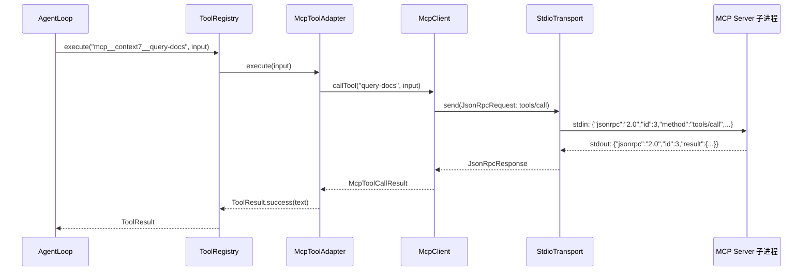

# MCP 集成架构

## 什么是 MCP？

MCP（Model Context Protocol）是一个开放协议，让 AI 应用能够连接外部工具和数据源。你可以把它理解为 **"AI 世界的 USB 接口"**：

- USB 让各种外设（键盘、鼠标、硬盘）即插即用
- MCP 让各种工具服务器（文件系统、数据库、API）即插即用

没有 MCP 之前，想给 Agent 添加新工具，必须写代码实现 `Tool` 接口。有了 MCP 之后，只要在配置文件里声明一个 MCP Server，它的工具就会自动出现在 Agent 的工具列表中。

## 为什么需要 MCP？

内置工具（Bash、Read、Edit 等）覆盖了基本的编程场景，但现实世界的需求远不止于此：

| 需求 | 没有 MCP | 有了 MCP |
|------|---------|---------|
| 查文档 | 只能 WebSearch | 接入 Context7 Server，直接查库文档 |
| 操作数据库 | 写 Bash 执行 SQL | 接入 Database Server，结构化查询 |
| 管理 GitHub | 写 Bash 调 gh CLI | 接入 GitHub Server，原生 API 操作 |
| 自定义工具 | 改代码、重新编译 | 写个 MCP Server，配置即生效 |

**核心价值**：将工具的开发和使用解耦。工具开发者写 MCP Server，应用开发者只管配置和连接。

## 架构总览

MCP 子系统分为三层：



### 各层职责

| 层 | 组件 | 职责 |
|----|------|------|
| **配置层** | `McpConfigLoader` + `McpServerConfig` | 从 settings.json 读取 Server 配置，解析环境变量 |
| **客户端层** | `McpClient` + `StdioTransport` + JSON-RPC 消息 | 实现 MCP 协议通信：启动子进程、握手、工具发现、工具调用 |
| **集成层** | `McpManager` + `McpToolAdapter` | 编排整个 MCP 子系统，将远程工具适配为本地 Tool 接口 |

## 核心流程

### 启动阶段：连接 & 注册



### 运行阶段：工具调用



**关键点**：AgentLoop 调用 `mcp__context7__query-docs` 和调用内置的 `Read` 完全一样——都是 `toolRegistry.execute(name, input)`。MCP 的复杂性被 `McpToolAdapter` 完全封装了。

## 通信协议：JSON-RPC 2.0

MCP 基于 JSON-RPC 2.0 协议通信。每条消息都是一行 JSON，通过子进程的 stdin/stdout 传输。

### 请求（Request）

```json
{
  "jsonrpc": "2.0",
  "id": 1,
  "method": "tools/call",
  "params": {
    "name": "query-docs",
    "arguments": { "libraryId": "/vercel/next.js", "query": "routing" }
  }
}
```

### 响应（Response）

```json
{
  "jsonrpc": "2.0",
  "id": 1,
  "result": {
    "content": [{ "type": "text", "text": "Next.js uses file-based routing..." }],
    "isError": false
  }
}
```

### 通知（Notification）

没有 `id` 字段，不需要响应：

```json
{
  "jsonrpc": "2.0",
  "method": "notifications/initialized"
}
```

## 关键设计决策

### 1. 适配器模式 — 对 AgentLoop 完全透明

```
MCP Server 工具                    本地 Tool 接口
┌─────────────────┐    Adapter    ┌─────────────────┐
│ name: query-docs│ ──────────→  │ name: mcp__ctx__ │
│ description: ...│              │       query-docs  │
│ inputSchema: {} │              │ execute() → RPC   │
└─────────────────┘              └─────────────────┘
```

`McpToolAdapter` 实现 `Tool` 接口，把 `execute()` 调用转发为 JSON-RPC `tools/call` 请求。注册到 `ToolRegistry` 后，AgentLoop **无法区分**它和内置工具。

这种设计的好处：
- **零侵入**：不需要修改 AgentLoop 的任何代码
- **统一权限**：MCP 工具和内置工具走同一套 PermissionManager
- **统一生命周期**：ToolRegistry 统一管理所有工具的注册/查找/执行

### 2. 命名规范 — 避免冲突

MCP 工具名格式：`mcp__<serverName>__<toolName>`

例如：
- `mcp__filesystem__read_file`
- `mcp__context7__query-docs`
- `mcp__github__create_issue`

`mcp__` 前缀确保不会和内置工具冲突，`serverName` 中缀区分不同 Server 的同名工具。

### 3. 安全策略 — Human-in-the-loop

```java
// McpToolAdapter.java
@Override
public boolean requiresPermission() {
    return true;  // MCP 工具一律需要用户审批
}
```

外部 Server 的工具行为不可预测，所以 **所有 MCP 工具** 默认需要用户确认才能执行。这和内置的只读工具（Read、Glob、Grep 自动放行）不同。

### 4. 容错隔离 — 单个失败不影响全局

```java
// McpManager.initializeAndRegister()
for (Map.Entry<String, McpServerConfig> entry : configs.entrySet()) {
    try {
        connectAndRegister(serverName, config, registry);
    } catch (Exception e) {
        System.err.println("[MCP] Failed to connect to server '" + serverName + "': ...");
        // 继续处理下一个 Server
    }
}
```

配置了 3 个 MCP Server，其中 1 个启动失败？没关系，另外 2 个照常工作。

### 5. 进程生命周期管理

```java
// ClaudeCode.java — 注册 ShutdownHook
Runtime.getRuntime().addShutdownHook(new Thread(() -> {
    try { mcpManager.close(); } catch (IOException ignored) {}
}));
```

MCP Server 作为子进程运行，JVM 退出时必须清理。`McpManager.close()` 遍历所有 `McpClient`，每个 Client 调用 `transport.close()` → `process.destroyForcibly()`。

## 配置说明

### 配置文件位置

| 级别 | 路径 | 优先级 |
|------|------|--------|
| 用户级 | `~/.claude-code-java/settings.json` | 低 |
| 项目级 | `<projectDir>/.claude-code-java/settings.json` | 高（覆盖同名 Server） |

### 配置格式

```json
{
  "mcpServers": {
    "<serverName>": {
      "command": "可执行命令",
      "args": ["参数1", "参数2"],
      "env": {
        "KEY": "value",
        "SECRET": "${MY_SECRET}"
      }
    }
  }
}
```

### 环境变量插值

`env` 值中的 `${ENV_VAR}` 会被替换为实际环境变量值：

```json
{
  "env": {
    "GITHUB_TOKEN": "${GITHUB_TOKEN}"
  }
}
```

如果环境变量不存在，替换为空字符串。

## 扩展性

当前只实现了 `StdioTransport`（子进程通信），`McpTransport` 接口预留了扩展点：

| Transport | 通信方式 | 状态 |
|-----------|---------|------|
| `StdioTransport` | 子进程 stdin/stdout | 已实现 |
| `HttpSseTransport` | HTTP + Server-Sent Events | 规划中 |

新增 Transport 只需实现 `McpTransport` 接口的 5 个方法，不需要修改 `McpClient` 或上层代码。

## 思考题

1. 如果一个 MCP Server 在运行过程中崩溃了（子进程异常退出），追踪 `StdioTransport` 到 `McpToolAdapter` 的错误传播链路
2. 为什么 `McpToolAdapter.requiresPermission()` 返回 `true`？如果改为 `false` 会有什么安全风险？
3. 当两个不同的 MCP Server 暴露了同名工具 `read_file`，最终注册到 `ToolRegistry` 的名称分别是什么？会冲突吗？
4. 设计一个 `HttpSseTransport`，它需要实现 `McpTransport` 的哪些方法？与 `StdioTransport` 的主要区别是什么？

## 下一步

接下来深入了解各层的代码实现：

- [McpManager 与 McpToolAdapter](/core-code/mcp-manager) — 集成层编排与适配
- [McpClient 与 StdioTransport](/core-code/mcp-client) — 客户端协议通信
- [MCP 配置加载](/core-code/mcp-config) — 配置解析与环境变量插值
