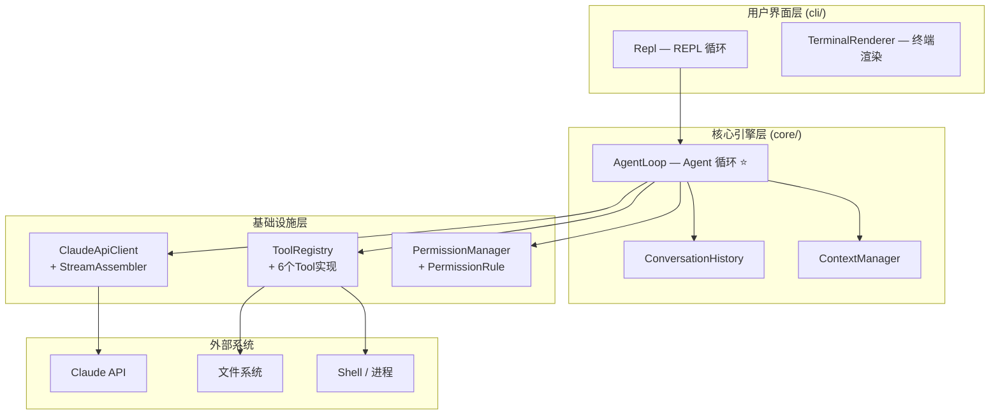
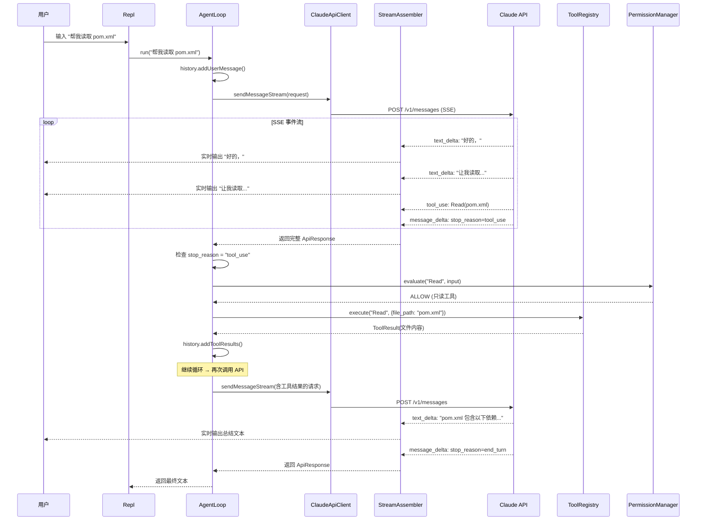

# 整体架构

## 架构总览

claude-code-java 采用**分层架构**，从上到下分为四层：



## 核心数据流

一次完整的用户交互，数据流经所有模块：



## 两种核心场景

### 场景 A：简单问答（无工具调用）

```
用户: "Java 的 final 关键字有什么用？"
  → AgentLoop 调用 API
  → Claude 直接返回文本回答
  → stop_reason = "end_turn"
  → 循环结束，返回文本
```

只经历 **1 轮循环**。

### 场景 B：工具调用（多轮循环）

```
用户: "查看 src 目录结构并读取 pom.xml"
  → 第 1 轮: Claude 返回 tool_use(Glob) → 执行 Glob → 结果回传
  → 第 2 轮: Claude 返回 tool_use(Read) → 执行 Read → 结果回传
  → 第 3 轮: Claude 返回文本总结 → stop_reason = "end_turn"
  → 循环结束
```

经历 **3 轮循环**，Claude 自主决定何时使用什么工具。

## 关键设计决策

### 1. 依赖注入 vs 内部创建

```java
// ✅ 实际采用：构造函数注入
public AgentLoop(ClaudeApiClient apiClient,
                 ToolRegistry toolRegistry,
                 PermissionManager permissionManager, ...) {
    this.apiClient = apiClient;
    this.toolRegistry = toolRegistry;
    // ...
}
```

组件通过构造函数注入，而不是在内部 new 出来。这使得：
- 各模块可以独立测试（传入 mock 对象）
- 配置灵活（不同场景可以传入不同实现）
- 依赖关系显式可见

### 2. 回调驱动的实时输出

```java
// AgentLoop 的 outputCallback
Consumer<String> outputCallback = System.out::print;

// 传递给 API 客户端
apiClient.sendMessageStream(request, outputCallback);
```

文本通过回调函数实时输出到终端，而不是等 API 调用完成后才显示。这样用户可以看到 "打字机效果"。

### 3. 安全优先的工具执行

每次工具调用前都要经过权限检查：

```
工具调用请求 → PermissionManager.evaluate()
  → ALLOW → 直接执行
  → DENY  → 返回拒绝信息给 Claude
  → ASK   → 弹出终端提示，等用户确认
```

只读工具（Read、Glob、Grep）自动放行，写入工具（Bash、Edit、Write）需要用户审批。

### 4. 错误不扩散

```java
// ToolRegistry.execute() 的双重安全
public ToolResult execute(String toolName, Map<String, Object> input) {
    Tool tool = tools.get(toolName);
    if (tool == null) {
        return ToolResult.error("Unknown tool: " + toolName);  // 安全 1
    }
    try {
        return tool.execute(input);
    } catch (Exception e) {
        return ToolResult.error("Tool threw exception: " + e.getMessage());  // 安全 2
    }
}
```

工具执行的异常被捕获并转为 error 结果反馈给 Claude，而不是让异常传播到 AgentLoop。这保证了单个工具的失败不会导致整个系统崩溃。

## 下一步

接下来让我们深入 [Agent Loop 核心循环](/architecture/agent-loop) —— 整个系统最核心的设计。
