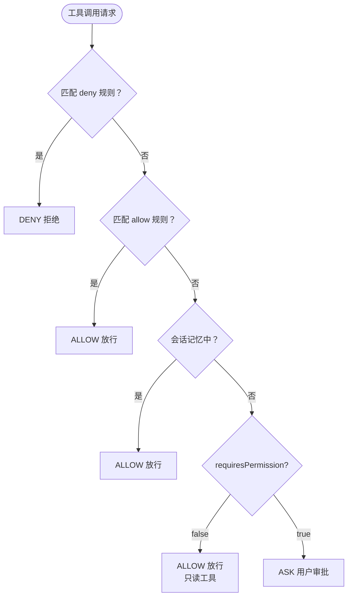

# 权限管理

## 为什么需要权限管理？

LLM 是不确定的系统 —— 它可能在你不知情的情况下执行危险操作：

```bash
# Claude 可能认为这是"清理项目"的一部分
rm -rf /important-data

# 或者读取敏感文件
cat ~/.ssh/id_rsa
```

因此，对于所有 **有副作用** 的操作（写文件、执行命令），系统默认要求用户审批。

## 核心理念：最小权限 + 人在回路

```
只读操作 → 自动放行（Read, Glob, Grep）
写入操作 → 用户审批（Bash, Edit, Write）
```

这就是 **Human-in-the-loop（人在回路中）** 模式：AI 有能力，但关键操作需要人类确认。

## 权限评估三种结果

| 结果 | 含义 | 用户体验 |
|------|------|---------|
| **ALLOW** | 直接放行 | 用户无感知 |
| **DENY** | 直接拒绝 | 工具不执行，返回错误给 Claude |
| **ASK** | 暂停等待 | 终端弹出审批框，等用户输入 y/n/a |

## 评估优先级链



优先级从高到低：
1. **deny 规则** — 一票否决，最高优先级
2. **allow 规则** — 配置的白名单
3. **会话记忆** — 用户之前选了 "always"
4. **工具属性** — `requiresPermission()` 返回 false 则放行
5. **默认** — 以上都不匹配，ASK

## 用户审批交互

当权限评估结果为 ASK 时，终端会弹出审批框：

```
┌──────────────────────────────────────────────┐
│  Tool: Bash                                  │
│  Command: npm install express                │
│                                              │
│  Allow? (y)es / (n)o / (a)lways             │
└──────────────────────────────────────────────┘
  >
```

| 用户输入 | 效果 |
|---------|------|
| `y` / `yes` | 本次允许 |
| `n` / `no` | 本次拒绝 |
| `a` / `always` | 允许，并记住（后续同工具不再询问） |

## 会话记忆机制

用户选择 "always" 后，系统会记住这个决定（仅当前会话有效）：

```java
// 粗粒度：批准该工具的所有调用
approvedTools.add("Bash");

// 细粒度：只批准匹配特定模式的调用
approvalRules.add(new PermissionRule("Bash", "npm run *"));
```

## 权限规则

`PermissionRule` 支持通配符匹配：

```java
// 规则示例
new PermissionRule("Bash", "npm run *")    // 匹配所有 npm run 命令
new PermissionRule("Bash", "git *")        // 匹配所有 git 命令
new PermissionRule("Read", "/etc/*")       // 匹配 /etc/ 下的文件
```

不同工具类型匹配不同的参数字段：

| 工具 | 匹配字段 | 示例规则 |
|------|---------|---------|
| Bash | `command` | `"rm -rf *"` |
| Read / Edit / Write | `file_path` | `"/etc/*"` |
| Glob / Grep | `pattern` | `"*.env"` |

## 各工具的权限标记

| 工具 | `requiresPermission()` | 原因 |
|------|----------------------|------|
| ReadFileTool | `false` | 只读，不改变系统状态 |
| GlobTool | `false` | 只读，文件搜索 |
| GrepTool | `false` | 只读，内容搜索 |
| BashTool | `true` | 可以执行任意命令 |
| EditFileTool | `true` | 修改文件内容 |
| WriteFileTool | `true` | 创建/覆写文件 |

## 设计权衡

::: tip 安全 vs 效率
权限管理在安全性和使用效率之间做了平衡：
- 只读工具自动放行 → 不打断 AI 的信息收集流程
- 写入工具需审批 → 防止意外的系统修改
- "always" 选项 → 信任建立后减少打扰
:::

## 思考题

1. 如何配置 deny 规则来禁止 Claude 执行任何包含 `rm` 的命令？
2. ReadFileTool 标记为不需要权限。能否构造一个只通过读文件就造成安全风险的场景？
3. 如果要将权限规则持久化到文件（跨会话），你会怎么设计存储格式？

## 下一步

架构设计部分到此结束。接下来进入 [核心代码讲解](/core-code/entry-point)，看看这些设计是如何用 Java 代码实现的。
