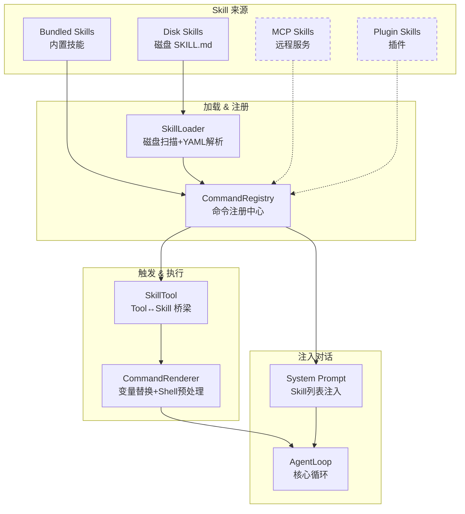
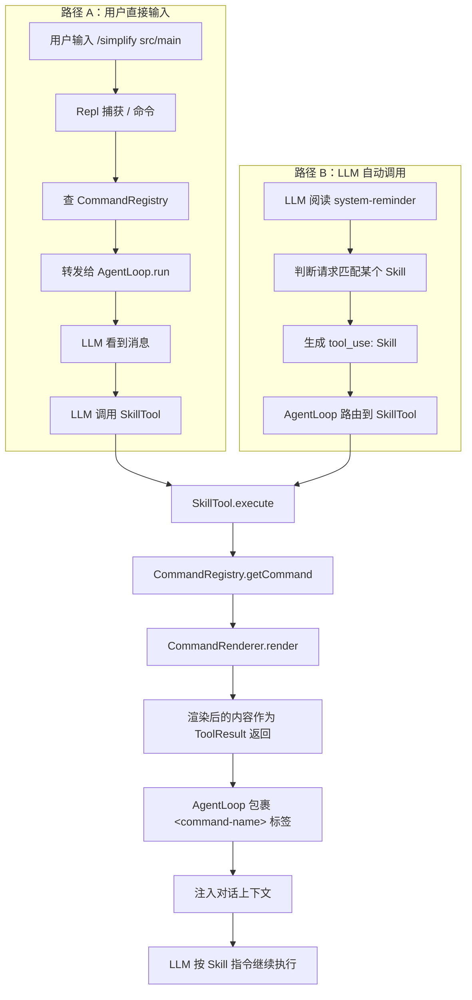
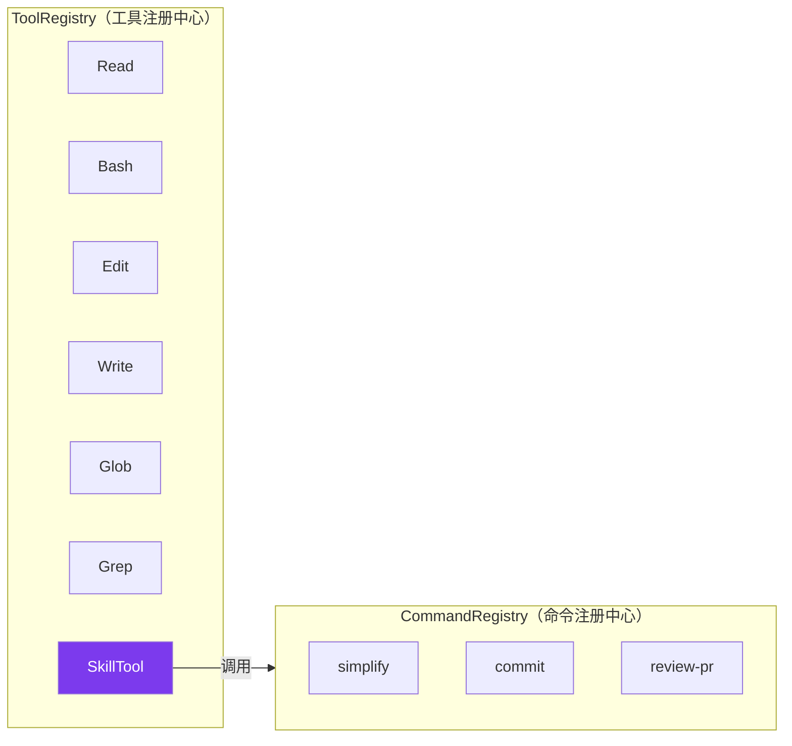

# Skill 系统架构

Skill 系统是 claude-code-java 中最具设计巧思的模块 —— 它让 LLM 学会「按剧本演出」。

## 从生活类比开始

想象你是一个剧团导演（LLM），面对各种演出需求。

**没有 Skill 的情况**：观众说"演一出莎士比亚"，你只能靠自己的记忆即兴发挥，质量参差不齐。

**有 Skill 的情况**：助理递给你一份详细的「演出手册」（Skill），里面写着角色设定、台词要点、舞台指示。你按手册演出，质量稳定可控。

这就是 Skill 的本质 —— **它不是代码插件，而是一份给 LLM 的「工作手册」**。

## 一个核心认知

::: danger 这是理解 Skill 系统最重要的一句话
**Skill 就是 Command。** 具体来说，Skill 是 `type='prompt'` 的 Command，它复用了整个 Command 基础设施（注册、发现、路由、执行）。Skill 不是一个独立的概念。
:::

在代码中的体现：

| 概念 | 对应的类 | 说明 |
|------|---------|------|
| Command（命令） | `Command` 接口 | 所有命令的顶层抽象 |
| Skill（技能） | `PromptCommand` 类 | `type=PROMPT` 的 Command |
| 内置命令 | Repl 中硬编码 | `type=BUILTIN`，如 /help、/exit |

## 整体架构



> 虚线表示当前版本未实现，预留给未来扩展。

## Skill 的 5 大来源

| 来源 | 加载方式 | 路径 | 当前状态 |
|------|---------|------|---------|
| Bundled | 启动时代码注册 | `resources/skills/` | 待实现(P1) |
| Disk | SkillLoader 扫描 SKILL.md | `~/.claude-code-java/skills/` | **已实现** |
| MCP | MCP 服务器动态提供 | 通过 McpManager | 待实现(P2) |
| Plugin | 内置/市场插件 | 插件目录 | 待实现(P3) |
| 动态发现 | 模型操作文件时向上遍历 | 中间路径的 skills/ | 待实现(P3) |

当前版本实现了最核心的 **Disk** 来源，它覆盖了 90% 的使用场景。

## Skill 的数据结构

一个 Skill 在内存中由 `PromptCommand` 表示：

```java
PromptCommand {
    name = "simplify"                          // ← 命令名，也是 /simplify 的触发词
    description = "审查代码质量和效率"            // ← 注入 system-reminder，LLM 据此判断是否匹配
    source = DISK                               // ← 来源（决定覆盖优先级）
    skillDir = /project/.claude-code-java/skills/simplify/
    context = "inline"                          // ← 执行模式：inline 或 fork
    allowedTools = ["Read", "Bash"]             // ← 激活时免审批的工具
    rawContent = "你是一个代码审查专家..."        // ← 提示词正文（未渲染）
    disableModelInvocation = false              // ← 是否禁止 LLM 自动调用
    userInvocable = true                        // ← 是否出现在 / 菜单中
}
```

它来自 SKILL.md 文件的解析：

```markdown
---
description: 审查代码质量和效率
allowed-tools:
  - Read
  - Bash
context: inline
---

你是一个代码审查专家...
请检查 $ARGUMENTS 中指定的文件...
```

## 两条触发路径

Skill 的触发有两条完全不同的路径，但最终都汇聚到 SkillTool：



::: tip 为什么路径 A 不在 Repl 中直接执行 Skill？
因为 Skill 的本质是「提示词」，需要 LLM 来解读和执行。Repl 只负责发现用户想调用 Skill，然后交给 AgentLoop，让 LLM 通过标准的工具调用链路来加载 Skill。这样两条路径的执行逻辑完全一致。
:::

## 渐进式上下文加载

Skill 系统采用**渐进式加载**策略，精打细算地使用上下文窗口：

| 阶段 | 加载内容 | token 开销 |
|------|---------|-----------|
| 始终在上下文 | name + description 列表 | 约 100 token/skill |
| 按需加载 | 完整 SKILL.md 正文 | 约 500-5000 token |
| 从不加载 | 未被触发的 Skill 正文 | 0 |

```
系统提示词 = 基础 system prompt
            + <system-reminder>
                - simplify: 审查代码质量        ← 始终在上下文（~100 token）
                - commit: 创建 git commit       ← 始终在上下文（~100 token）
              </system-reminder>

当 LLM 调用 SkillTool("simplify") 时：
  → 才加载 SKILL.md 完整内容（~2000 token）
  → 注入到对话中
```

::: warning 为什么不把所有 Skill 的完整内容都放进系统提示？
上下文窗口是稀缺资源。如果你有 20 个 Skill，每个 2000 token，那就占掉了 40000 token —— 几乎是上下文窗口的 1/5。渐进式加载确保只有「真正被使用的 Skill」才占用上下文。
:::

## Inline vs Fork 执行模式

| 对比维度 | Inline（默认） | Fork |
|---------|---------------|------|
| 上下文 | 共享主对话 | 独立子 Agent |
| Token 预算 | 与主对话共享 | 有自己的预算 |
| 历史可见性 | LLM 能看到之前的对话 | 看不到主对话历史 |
| 结果处理 | 直接在当前对话继续 | 文本结果返回主对话 |
| 适用场景 | 大多数 Skill | 需要大量上下文的复杂 Skill |
| 当前支持 | **已实现** | 待实现(P2) |

类比：
- **Inline** = 在当前函数里直接写代码（共享局部变量）
- **Fork** = 调用一个新函数（有自己的作用域，返回值回传）

## 与 Tool 系统的关系

初学者容易混淆 Skill 和 Tool，它们通过 SkillTool 产生了桥接：



**SkillTool 是两个 Registry 之间的桥梁**：
- 它是一个 Tool（注册在 ToolRegistry 中）
- 它的 `execute()` 方法内部调用 CommandRegistry
- LLM 通过标准的 `tool_use` 机制触发它

## 关键设计亮点

| 设计 | 说明 |
|------|------|
| 统一抽象 | Skill = PromptCommand = Command，复用全套基础设施 |
| 双向触发 | 用户 /name + LLM 自动匹配，两条路径汇聚到 SkillTool |
| 渐进加载 | 只有 description 始终在上下文，正文按需加载 |
| 优先级覆盖 | Bundled < Disk(用户级) < Disk(项目级)，方便定制 |
| 三层权限 | deny/allow 规则 → 安全属性白名单 → 交互式询问 |

## 思考题

1. 如果两个 Skill 的 description 很相似（比如都是"代码审查"），LLM 会怎么选择？你能想到什么优化方案？
2. 当前 Skill 列表在启动时加载一次。如果用户在运行中添加了新的 SKILL.md，需要重启才能生效。如何实现「热加载」？
3. Fork 模式中，子 Agent 看不到主对话历史。这在什么场景下是优势？什么场景下是劣势？

## 下一步

理解了 Skill 系统的整体架构后，让我们看看 [CommandRegistry 命令注册中心](/core-code/command-registry) 的具体实现。
