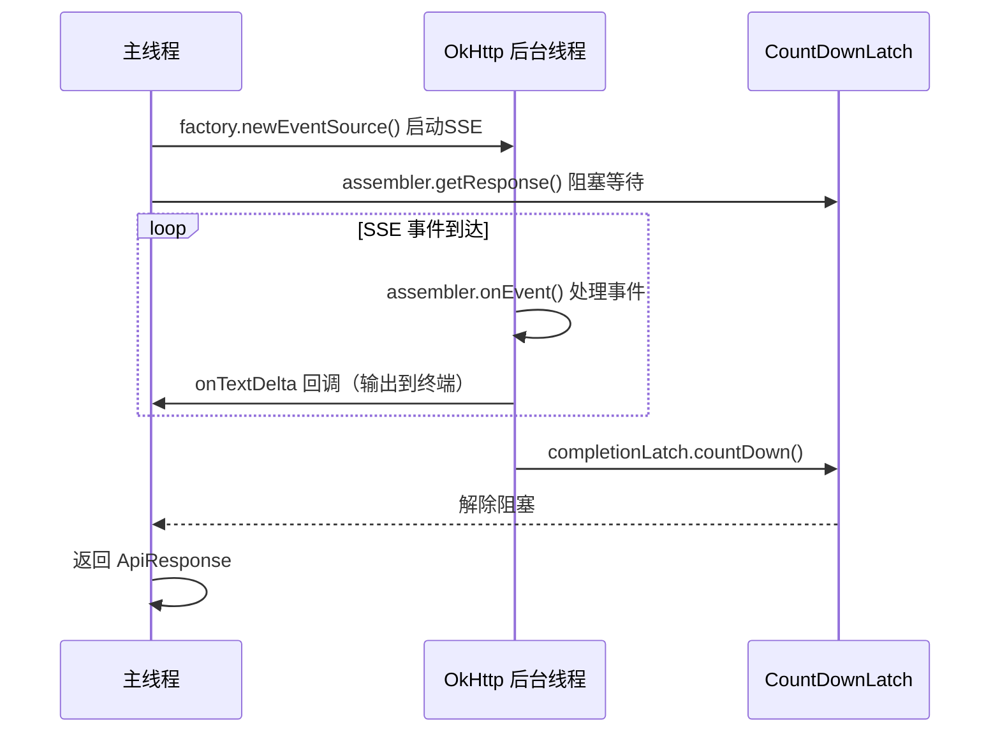

# API Client 详解

`ClaudeApiClient.java` 封装了与 Claude API 的所有 HTTP 通信。

## 源文件

📄 `claude-code-java/src/main/java/com/claudecode/api/ClaudeApiClient.java`（约 298 行）

## 类结构

```java
public class ClaudeApiClient {
    private static final String API_URL = "https://api.anthropic.com/v1/messages";
    private static final String API_VERSION = "2023-06-01";
    private static final int MAX_RETRIES = 3;

    private final String apiKey;
    private final String defaultModel;
    private final OkHttpClient httpClient;
    private final ObjectMapper mapper;     // Jackson JSON 处理

    // 两种调用方式
    public ApiResponse sendMessage(ApiRequest request);           // 非流式
    public ApiResponse sendMessageStream(ApiRequest request,      // 流式
                                         Consumer<String> onTextDelta);
}
```

## 非流式调用：sendMessage()

```java
public ApiResponse sendMessage(ApiRequest request) throws IOException {
    ApiRequest actualRequest = ensureStreamFlag(request, false);  // 强制 stream=false
    String jsonBody = mapper.writeValueAsString(actualRequest);
    Request httpRequest = buildHttpRequest(jsonBody);
    return executeWithRetry(httpRequest);                         // 带 429 重试
}
```

流程很简单：序列化 → 发送 → 等待 → 反序列化。适合调试场景。

## 流式调用：sendMessageStream()

```java
public ApiResponse sendMessageStream(ApiRequest request,
                                     Consumer<String> onTextDelta) throws Exception {
    // 1. 强制 stream=true
    ApiRequest actualRequest = ensureStreamFlag(request, true);
    String jsonBody = mapper.writeValueAsString(actualRequest);
    Request httpRequest = buildHttpRequest(jsonBody);

    // 2. 创建 SSE 事件处理器
    StreamAssembler assembler = new StreamAssembler(mapper, onTextDelta);

    // 3. 建立 SSE 连接（后台线程处理事件）
    EventSource.Factory factory = EventSources.createFactory(httpClient);
    factory.newEventSource(httpRequest, assembler);

    // 4. 阻塞等待流完成
    return assembler.getResponse(300);
}
```

### 关键：线程模型



- **主线程**：调用 `assembler.getResponse()` 后阻塞等待
- **后台线程**：OkHttp 的线程处理 SSE 事件，调用 `assembler.onEvent()`
- **同步点**：`CountDownLatch` —— 后台线程在流结束时 `countDown()`，主线程的 `await()` 解除阻塞

## HTTP 请求构建

```java
Request buildHttpRequest(String jsonBody) {
    RequestBody body = RequestBody.create(jsonBody, MediaType.get("application/json"));

    return new Request.Builder()
        .url(API_URL)
        .post(body)
        .addHeader("x-api-key", apiKey)            // API 密钥
        .addHeader("anthropic-version", API_VERSION) // API 版本
        .addHeader("content-type", "application/json")
        .build();
}
```

三个必须的请求头缺一不可：
- `x-api-key`：认证
- `anthropic-version`：API 版本（影响响应格式）
- `content-type`：告诉服务器请求体是 JSON

## ensureStreamFlag：不可变对象的修改

```java
private ApiRequest ensureStreamFlag(ApiRequest request, boolean stream) {
    return ApiRequest.builder()
        .model(request.getModel() != null ? request.getModel() : defaultModel)
        .maxTokens(request.getMaxTokens())
        .system(request.getSystem())
        .stream(stream)                      // ← 修改这个字段
        .tools(request.getTools())
        .messages(request.getMessages())
        .build();
}
```

::: tip 为什么不直接 request.setStream(true)？
`ApiRequest` 是**不可变对象**（所有字段都是 `final`）。要修改某个字段，只能通过 Builder 重新构建一个新对象。这是 Builder 模式的典型应用场景。
:::

## 429 限流重试

```java
private ApiResponse executeWithRetry(Request httpRequest) throws IOException {
    int retries = 0;
    while (true) {
        try (Response response = httpClient.newCall(httpRequest).execute()) {
            if (response.code() == 200) {
                return mapper.readValue(response.body().string(), ApiResponse.class);
            }
            if (response.code() == 429 && retries < MAX_RETRIES) {
                retries++;
                long waitSeconds = getRetryAfterSeconds(response, retries);
                Thread.sleep(waitSeconds * 1000);  // 指数退避
                continue;
            }
            throw new IOException(formatHttpError(response.code(), ...));
        }
    }
}
```

退避策略：
```
第 1 次重试: 等 2 秒  (2^1)
第 2 次重试: 等 4 秒  (2^2)
第 3 次重试: 等 8 秒  (2^3)
超过 3 次: 抛异常
```

如果响应头包含 `Retry-After`，优先使用服务器建议的等待时间。

## 错误信息格式化

```java
private String formatHttpError(int code, String body) {
    switch (code) {
        case 401: return "API Key is invalid or missing (HTTP 401).";
        case 403: return "Access denied (HTTP 403).";
        case 429: return "Rate limited (HTTP 429).";
        case 500: case 502: case 503:
            return "Claude API server error (HTTP " + code + ").";
        default: return "Claude API error (HTTP " + code + "): " + body;
    }
}
```

把 HTTP 状态码翻译成人类可读的错误提示。

## 思考题

1. 如果网络在 SSE 流传输过程中断了，`sendMessageStream()` 会怎么处理？
2. 为什么 `readTimeout` 设为 300 秒而不是更短？
3. 当前只有非流式调用支持 429 重试。如何为流式调用也加上重试？

## 下一步

API 客户端发起 SSE 连接后，事件的处理交给了 [StreamAssembler](/core-code/stream-assembler)。
