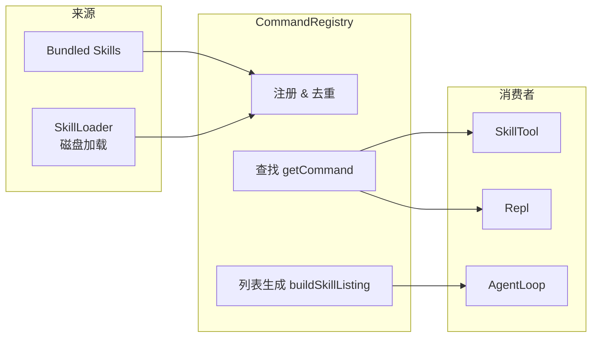

# CommandRegistry 命令注册中心

CommandRegistry 是 Skill 系统的「大脑」—— 所有来源的 Skill 最终都汇聚到这里。

## 源文件

📄 `claude-code-java/src/main/java/com/claudecode/command/CommandRegistry.java`

## 与 ToolRegistry 的对比

项目中有两个 Registry，初学者容易搞混：

| 对比维度 | ToolRegistry | CommandRegistry |
|---------|-------------|-----------------|
| 管理什么 | Tool（工具：Read, Bash 等） | Command（命令/Skill） |
| 被谁调用 | AgentLoop 执行工具 | SkillTool + Repl |
| 注入方式 | API 请求的 `tools` 字段 | 系统提示词的 `<system-reminder>` |
| 内部存储 | `LinkedHashMap<String, Tool>` | `LinkedHashMap<String, PromptCommand>` |

类比：ToolRegistry 是「工具箱」（锤子、螺丝刀），CommandRegistry 是「剧本架」（各种演出手册）。

## 核心职责



三大核心职责：
1. **initialize()** —— 启动时汇聚所有来源的 Skill
2. **getCommand(name)** —— 供 SkillTool 和 Repl 查找特定 Skill
3. **buildSkillListing()** —— 生成 Skill 列表注入系统提示词

## 初始化流程

```java
public void initialize() {
    commands.clear();

    // 阶段 1：加载 Bundled Skill（优先级最低）
    // TODO: P1 阶段实现
    // loadBundledSkills();

    // 阶段 2：加载磁盘 Skill（优先级较高，会覆盖 Bundled）
    loadDiskSkills();
}
```

加载顺序**决定了覆盖优先级**：后加载的同名 Skill 会覆盖先加载的。

```
Bundled "simplify"   ← 先加载（优先级低）
Disk    "simplify"   ← 后加载，覆盖 Bundled 版本
```

::: tip 为什么用 put 覆盖而不是判断冲突？
这是有意为之。用户可能对内置 Skill 不满意，想用自己的版本替换。通过在 `~/.claude-code-java/skills/simplify/` 放一个同名 SKILL.md，就能无痛覆盖内置版本。
:::

### 磁盘加载

```java
private void loadDiskSkills() {
    SkillLoader loader = new SkillLoader(workingDirectory);
    List<PromptCommand> diskSkills = loader.loadAll();

    for (PromptCommand skill : diskSkills) {
        commands.put(skill.name(), skill);  // ← 同名覆盖
    }
}
```

SkillLoader 内部已经处理了用户级和项目级的优先级（项目级覆盖用户级），这里直接 put 即可。

## Skill 列表生成（核心方法）

`buildSkillListing()` 是整个 Skill 系统最关键的方法之一 —— 它决定了 LLM 能「看到」哪些 Skill。

```java
public String buildSkillListing() {
    // 过滤：有描述 + 没有禁止 LLM 调用
    List<PromptCommand> listable = commands.values().stream()
            .filter(PromptCommand::shouldListForModel)
            .collect(Collectors.toList());

    if (listable.isEmpty()) return "";

    StringBuilder sb = new StringBuilder();
    sb.append("\n<system-reminder>\n");
    sb.append("The following skills are available for use with the Skill tool:\n\n");

    for (PromptCommand cmd : listable) {
        sb.append("- ").append(cmd.name());
        if (cmd.description() != null && !cmd.description().isEmpty()) {
            sb.append(": ").append(cmd.description());
        }
        sb.append("\n");
    }

    sb.append("</system-reminder>");
    return sb.toString();
}
```

生成的文本会被追加到系统提示词末尾：

```
<system-reminder>
The following skills are available for use with the Skill tool:

- simplify: 审查代码质量和效率
- commit: 创建 git commit
- xhs-note-creator: 小红书笔记素材创作技能
</system-reminder>
```

### 过滤规则

不是所有 Skill 都会出现在列表中：

```java
public boolean shouldListForModel() {
    return description != null          // ← 必须有描述（否则 LLM 无法判断）
        && !description.isEmpty()
        && !disableModelInvocation;     // ← 没有禁止 LLM 调用
}
```

| 场景 | 出现在列表？ | 原因 |
|------|-------------|------|
| 有描述，允许 LLM 调用 | 是 | 正常情况 |
| 没有描述 | 否 | LLM 不知道什么时候该用它 |
| `disable-model-invocation: true` | 否 | 只允许用户手动触发 |
| `user-invocable: false` | **是** | 它是「仅 LLM 可调用」的，LLM 需要看到它 |

::: warning 注意第 4 种情况
`user-invocable: false` 的 Skill 虽然不出现在用户的 /help 菜单中，但**必须**出现在 LLM 的可用列表中 —— 因为它就是为 LLM 自动触发设计的。
:::

## 在 AgentLoop 中的使用

AgentLoop 的 `buildRequest()` 方法在构建 API 请求时，会将 Skill 列表拼接到系统提示词中：

```java
private ApiRequest buildRequest() {
    String fullSystemPrompt = systemPrompt;
    if (commandRegistry != null) {
        String skillListing = commandRegistry.buildSkillListing();
        if (!skillListing.isEmpty()) {
            fullSystemPrompt = systemPrompt + "\n" + skillListing;  // ← 拼接
        }
    }

    return ApiRequest.builder()
            .model(model)
            .system(fullSystemPrompt)  // ← 包含 Skill 列表的完整提示词
            .tools(toolRegistry.getAllDefinitions())
            .messages(new ArrayList<>(history.getMessages()))
            .build();
}
```

## 在 ClaudeCode 启动中的位置

```java
// ClaudeCode.main() 中的初始化顺序
ToolRegistry toolRegistry = new ToolRegistry(workingDirectory);
toolRegistry.registerBuiltinTools();           // ← 先注册内置工具

CommandRegistry commandRegistry = new CommandRegistry(workingDirectory);
commandRegistry.initialize();                  // ← 再初始化 Skill 系统
toolRegistry.register(new SkillTool(commandRegistry));  // ← 桥接两个 Registry

AgentLoop agentLoop = new AgentLoop(
    apiClient, toolRegistry, permissionManager,
    systemPrompt, commandRegistry);            // ← 注入 CommandRegistry
```

::: tip 为什么 SkillTool 在 CommandRegistry 之后注册？
因为 SkillTool 的构造函数需要 CommandRegistry 实例。如果顺序反了，SkillTool 就拿不到任何 Skill。
:::

## 思考题

1. `commands` 使用 `LinkedHashMap` 而不是 `HashMap`，目的是什么？换成 `HashMap` 会有什么影响？
2. 当前 `initialize()` 是幂等的（多次调用会清空重建）。在什么场景下需要多次调用？
3. 如果 Skill 数量很多（比如 100 个），`buildSkillListing()` 生成的文本可能很长。官方用「预算控制」解决这个问题 —— 你会怎么实现？

## 下一步

理解了 CommandRegistry 后，让我们看看 [SkillLoader](/core-code/skill-loader) 是如何从磁盘加载和解析 SKILL.md 文件的。
