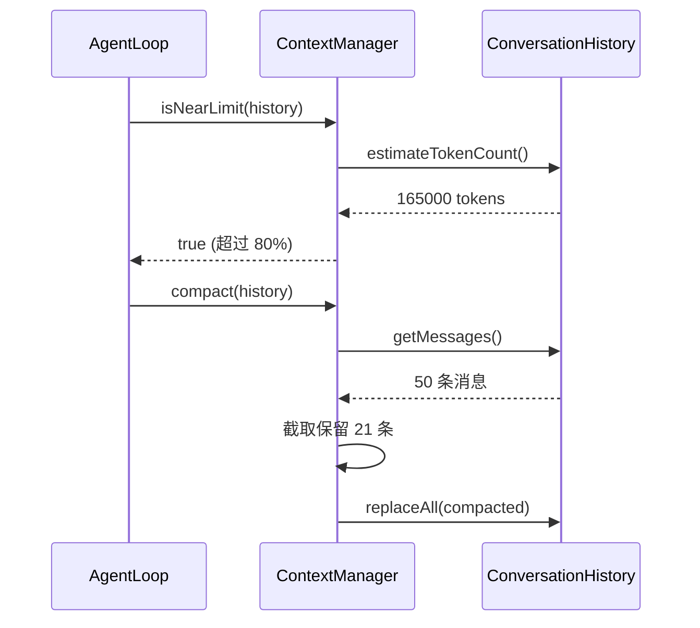

# 对话历史与上下文

对话管理由两个类协作完成：
- `ConversationHistory`：维护消息列表，确保格式正确
- `ContextManager`：监控 token 用量，触发压缩

## ConversationHistory

📄 `claude-code-java/src/main/java/com/claudecode/core/ConversationHistory.java`

### Claude API 的消息规则

Claude API 对消息有严格要求：

| 规则 | 说明 |
|------|------|
| **角色交替** | user 和 assistant 必须严格交替，不允许连续两条相同角色 |
| **user 消息内容** | 可包含 TextBlock 和 ToolResultBlock |
| **assistant 消息内容** | 可包含 TextBlock 和 ToolUseBlock |
| **tool_result 归属** | 必须放在 user 消息中，通过 tool_use_id 配对 |

### 三种消息添加方式

```java
// 1. 用户输入 → 纯文本的 user 消息
history.addUserMessage("帮我读取 pom.xml");

// 2. API 响应 → assistant 消息（可能包含 text + tool_use）
history.addAssistantMessage(response.toMessage());

// 3. 工具结果 → user 消息（包含 ToolResultBlock）
history.addToolResults(results);
```

### 交替规则校验

```java
private void checkRoleAlternation(String newRole) {
    if (!messages.isEmpty()) {
        String lastRole = messages.get(messages.size() - 1).getRole();
        if (lastRole.equals(newRole)) {
            throw new IllegalStateException(
                "Cannot add consecutive '" + newRole + "' messages.");
        }
    }
}
```

每次添加消息前都检查：新消息的角色不能和最后一条消息相同。违反则抛异常 —— **快速失败**，而不是等 API 返回错误。

### Token 估算

```java
public int estimateTokenCount() {
    int totalChars = 0;
    for (Message msg : messages) {
        for (ContentBlock block : msg.getContent()) {
            if (block instanceof TextBlock) {
                totalChars += ((TextBlock) block).getText().length();
            } else if (block instanceof ToolResultBlock) {
                totalChars += ((ToolResultBlock) block).getContent().length();
            } else if (block instanceof ToolUseBlock) {
                totalChars += ((ToolUseBlock) block).getName().length();
                totalChars += ((ToolUseBlock) block).getInput().toString().length();
            }
        }
    }
    return totalChars / 4;  // 约每 4 字符 ≈ 1 token
}
```

::: tip 精确度说明
`每 4 字符 ≈ 1 token` 是粗略估算，对英文较准确。中文约 `每 2 字符 ≈ 1 token`。此处采用保守估算，宁可早触发压缩也不要超出限制。
:::

### 不可变视图

```java
public List<Message> getMessages() {
    return Collections.unmodifiableList(messages);
}
```

返回不可变视图，防止外部代码直接修改消息列表。所有修改必须通过 `addXxx()` 方法进行。

## ContextManager

📄 `claude-code-java/src/main/java/com/claudecode/core/ContextManager.java`

### 为什么需要上下文管理？

Claude 的上下文窗口是 **200K tokens**。每次 API 请求都会发送完整的对话历史。随着对话进行，token 不断增长，超限会导致 API 报错。

### 配置参数

```java
public ContextManager() {
    this(200_000,   // maxContextTokens: 窗口大小
         0.8,       // compactThreshold: 80% 触发压缩
         10);       // keepRecentTurns: 保留最近 10 轮
}
```

### 接近限制检测

```java
public boolean isNearLimit(ConversationHistory history) {
    int estimated = history.estimateTokenCount();
    return estimated > (int) (maxContextTokens * compactThreshold);
    // 即: estimated > 160,000 时触发
}
```

### 压缩策略（截断法）

```java
public void compact(ConversationHistory history) {
    List<Message> messages = history.getMessages();
    int total = messages.size();
    int keepRecent = keepRecentTurns * 2;  // 每轮 = user + assistant

    if (total <= keepRecent + 1) return;   // 太少，不压缩

    List<Message> compacted = new ArrayList<>();

    // 1. 保留第一条 user 消息（初始需求上下文）
    compacted.add(messages.get(0));

    // 2. 保留最近 N 条消息
    int recentStart = total - keepRecent;

    // 确保接续第一条 user 后的是 assistant（维持交替规则）
    if ("user".equals(messages.get(recentStart).getRole())) {
        recentStart++;
    }

    for (int i = recentStart; i < total; i++) {
        compacted.add(messages.get(i));
    }

    // 3. 验证交替规则
    for (int i = 1; i < compacted.size(); i++) {
        if (compacted.get(i).getRole().equals(compacted.get(i - 1).getRole())) {
            return;  // 无法保证交替 → 放弃压缩
        }
    }

    history.replaceAll(compacted);
}
```

**压缩前后对比：**

```
压缩前（50 条消息）:
[user₁] [asst₁] [user₂] [asst₂] ... [user₂₅] [asst₂₅]

压缩后（21 条消息）:
[user₁] [asst₁₆] [user₁₆] ... [user₂₅] [asst₂₅]
  ↑                ↑─────────────────────────────↑
  保留首条          保留最近 10 轮（20 条消息）
```

::: warning 为什么保留第一条消息？
第一条 user 消息包含用户的**初始需求**。即使中间历史被丢弃，保留它能让 Claude 记住"用户最开始想要什么"，避免偏离主题。
:::

### replaceAll 的访问控制

```java
// package-private（默认访问级别，没有 public/private/protected）
void replaceAll(List<Message> newMessages) {
    messages.clear();
    messages.addAll(newMessages);
}
```

这个方法只有同包的 `ContextManager` 能调用。外部代码无法直接替换消息列表 —— 这是**封装**的体现。

## 两个类的协作



## 思考题

1. 为什么 `compact()` 要确保截断后的消息仍满足 role 交替？如果不检查会发生什么？
2. 当前 token 估算对中文不够准确，你能想到更好的方案吗？
3. 如果要实现 "摘要压缩"（用 LLM 对旧历史生成摘要），需要修改哪些类？
4. `replaceAll` 为什么是 package-private 而不是 public？

## 下一步

最后来看用户直接面对的 [终端交互 REPL](/core-code/repl)。
