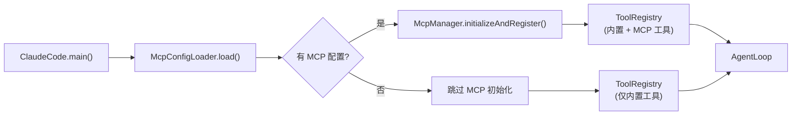

# MCP 配置加载

MCP 的配置系统负责从 `settings.json` 文件中读取 MCP Server 的定义，并支持环境变量插值。

## McpConfigLoader — 配置加载器

📄 `claude-code-java/src/main/java/com/claudecode/mcp/config/McpConfigLoader.java`

### 配置文件搜索路径

McpConfigLoader 从两个位置加载配置，项目级覆盖用户级：

```
优先级：低 ──────────────────────────────────────→ 高

~/.claude-code-java/settings.json       <projectDir>/.claude-code-java/settings.json
       (用户级，全局默认)                        (项目级，针对特定项目)
```

### 配置文件格式

```json
{
  "apiKey": "sk-...",
  "baseUrl": "https://api.example.com",
  "model": "claude-sonnet-4-20250514",
  "mcpServers": {
    "context7": {
      "command": "npx",
      "args": ["-y", "@upstash/context7-mcp"],
      "env": {}
    },
    "filesystem": {
      "command": "npx",
      "args": ["-y", "@modelcontextprotocol/server-filesystem", "/home/user/projects"],
      "env": {
        "NODE_ENV": "production"
      }
    },
    "github": {
      "command": "npx",
      "args": ["-y", "@modelcontextprotocol/server-github"],
      "env": {
        "GITHUB_TOKEN": "${GITHUB_TOKEN}"
      }
    }
  }
}
```

`mcpServers` 是一个 Map，key 是 Server 名称（用于日志和工具名前缀），value 是 `McpServerConfig`。

### load() — 加载流程

```java
public Map<String, McpServerConfig> load(String workingDirectory) {
    Map<String, McpServerConfig> merged = new LinkedHashMap<>();

    // 1. 先加载用户级（低优先级）
    File userConfig = new File(
            System.getProperty("user.home"), 
            ".claude-code-java/settings.json");
    merged.putAll(loadFromFile(userConfig));

    // 2. 再加载项目级（高优先级，同名覆盖）
    if (workingDirectory != null) {
        File projectConfig = new File(
                workingDirectory, 
                ".claude-code-java/settings.json");
        merged.putAll(loadFromFile(projectConfig));
    }

    // 3. 解析环境变量
    for (McpServerConfig config : merged.values()) {
        resolveEnvVars(config);
    }

    return merged;
}
```

**覆盖机制**：`LinkedHashMap.putAll()` 会覆盖同名 key。如果用户级和项目级都配置了 `filesystem` Server，项目级的配置会完全覆盖用户级。

### loadFromFile() — 单文件解析

```java
private Map<String, McpServerConfig> loadFromFile(File file) {
    if (!file.exists() || !file.isFile()) {
        return Collections.emptyMap();  // 文件不存在，返回空
    }
    try {
        JsonNode root = mapper.readTree(file);
        JsonNode mcpServers = root.get("mcpServers");
        if (mcpServers == null || !mcpServers.isObject()) {
            return Collections.emptyMap();  // 没有 mcpServers 字段
        }
        // Jackson 直接将 JSON 转为 Map<String, McpServerConfig>
        return mapper.convertValue(mcpServers,
                new TypeReference<LinkedHashMap<String, McpServerConfig>>() {});
    } catch (IOException e) {
        System.err.println("[MCP] Failed to load config...");
        return Collections.emptyMap();  // 解析失败也不抛异常
    }
}
```

注意：即使 `settings.json` 解析失败，也只是打印警告并返回空 Map，不会让程序崩溃。

### resolveEnvVars() — 环境变量插值

```java
private static final Pattern ENV_VAR_PATTERN = Pattern.compile("\\$\\{([^}]+)}");

private void resolveEnvVars(McpServerConfig config) {
    Map<String, String> env = config.getEnv();
    if (env.isEmpty()) return;

    Map<String, String> resolved = new LinkedHashMap<>();
    for (Map.Entry<String, String> entry : env.entrySet()) {
        resolved.put(entry.getKey(), resolveEnvValue(entry.getValue()));
    }
    env.clear();
    env.putAll(resolved);
}

private String resolveEnvValue(String value) {
    if (value == null) return null;
    Matcher matcher = ENV_VAR_PATTERN.matcher(value);
    StringBuffer sb = new StringBuffer();
    while (matcher.find()) {
        String envName = matcher.group(1);           // 提取变量名
        String envValue = System.getenv(envName);    // 从系统环境读取
        matcher.appendReplacement(sb, 
            envValue != null ? Matcher.quoteReplacement(envValue) : "");
    }
    matcher.appendTail(sb);
    return sb.toString();
}
```

这段代码使用正则表达式 `\$\{([^}]+)}` 匹配 `${VAR_NAME}` 模式：

```
输入: "Bearer ${GITHUB_TOKEN}"
                ↓
正则匹配: group(1) = "GITHUB_TOKEN"
                ↓
System.getenv("GITHUB_TOKEN") = "ghp_abc123..."
                ↓
输出: "Bearer ghp_abc123..."
```

如果环境变量不存在，替换为空字符串（`""`）。

### 使用 `Matcher.quoteReplacement()` 的原因

`appendReplacement()` 会特殊处理 `$` 和 `\`（反向引用语法）。如果环境变量值中恰好包含 `$1` 之类的字符串，不 quote 就会出错。`Matcher.quoteReplacement()` 确保替换值是纯文本。

---

## McpServerConfig — 配置数据模型

📄 `claude-code-java/src/main/java/com/claudecode/mcp/config/McpServerConfig.java`

```java
@JsonIgnoreProperties(ignoreUnknown = true)  // 忽略未知字段
public class McpServerConfig {
    private String command;          // 可执行命令，如 "npx"、"python"
    private List<String> args;       // 命令参数
    private Map<String, String> env; // 环境变量

    // getter 方法带空安全
    public List<String> getArgs() {
        return args != null ? args : Collections.emptyList();
    }
    public Map<String, String> getEnv() {
        return env != null ? env : Collections.emptyMap();
    }
}
```

### 字段说明

| 字段 | 类型 | 必填 | 说明 |
|------|------|------|------|
| `command` | String | 是 | 启动 MCP Server 的命令 |
| `args` | List\<String\> | 否 | 命令参数列表 |
| `env` | Map\<String, String\> | 否 | 传递给子进程的环境变量 |

### 配置示例

**最简配置**（只需 command + args）：

```json
{
  "mcpServers": {
    "context7": {
      "command": "npx",
      "args": ["-y", "@upstash/context7-mcp"]
    }
  }
}
```

**带环境变量的配置**：

```json
{
  "mcpServers": {
    "github": {
      "command": "npx",
      "args": ["-y", "@modelcontextprotocol/server-github"],
      "env": {
        "GITHUB_TOKEN": "${GITHUB_TOKEN}"
      }
    }
  }
}
```

**多个 Server**：

```json
{
  "mcpServers": {
    "context7": {
      "command": "npx",
      "args": ["-y", "@upstash/context7-mcp"]
    },
    "filesystem": {
      "command": "npx",
      "args": ["-y", "@modelcontextprotocol/server-filesystem", "/home/user"],
      "env": {}
    }
  }
}
```

## 配置加载在启动流程中的位置



MCP 是完全可选的——没有配置 `mcpServers` 时，系统和之前完全一样。

## 思考题

1. 如果用户级和项目级都配置了同名的 `context7` Server，但参数不同，最终哪个生效？为什么？
2. `${ENV_VAR}` 如果对应的环境变量不存在会怎样？这个行为合理吗？是否应该抛异常？
3. 当前的覆盖策略是"项目级完全覆盖用户级同名 Server"。能否改为"项目级和用户级的字段级合并"？需要改哪些代码？
4. `@JsonIgnoreProperties(ignoreUnknown = true)` 在 `McpServerConfig` 上有什么作用？如果删掉会怎样？

## 下一步

回到架构层面，了解 MCP 如何融入整体架构：[MCP 集成架构](/architecture/mcp)。
