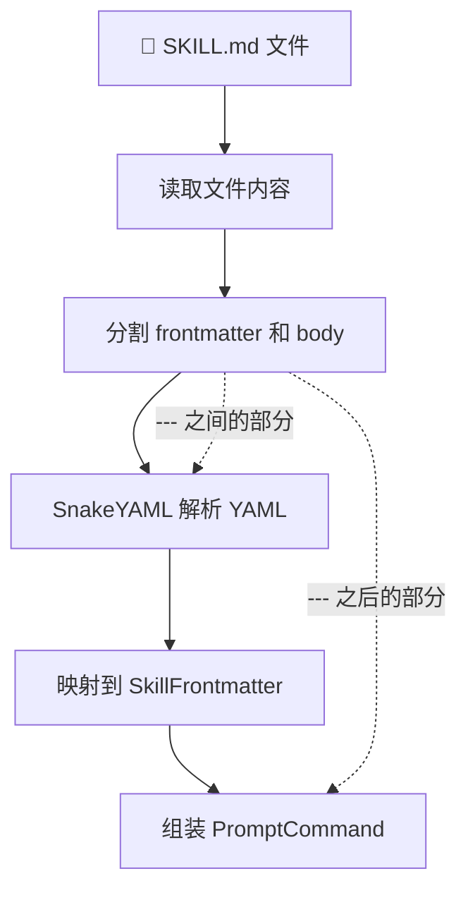

# SkillLoader 磁盘加载器

SkillLoader 负责将磁盘上的 SKILL.md 文件变成内存中的 PromptCommand 对象 —— 这是 Skill 的「诞生之路」。

## 源文件

📄 `claude-code-java/src/main/java/com/claudecode/command/loader/SkillLoader.java`
📄 `claude-code-java/src/main/java/com/claudecode/command/loader/SkillFrontmatter.java`

## 从 SKILL.md 到 PromptCommand

一个 SKILL.md 文件经过 SkillLoader 解析，最终变成一个 `PromptCommand` 对象。整个过程分为 5 步：



## 扫描路径（两级目录）

```
~/.claude-code-java/skills/          ← 用户级（对所有项目生效）
├── my-linter/
│   └── SKILL.md
└── translator/
    └── SKILL.md

<项目>/.claude-code-java/skills/     ← 项目级（仅当前项目生效）
├── deploy/
│   └── SKILL.md
└── my-linter/                       ← 同名！覆盖用户级的 my-linter
    └── SKILL.md
```

**优先级**：项目级 > 用户级。同名 Skill 时，项目级覆盖用户级。

```java
/** 用户级 Skill 目录 */
private static final String USER_SKILLS_DIR = ".claude-code-java/skills";

/** 项目级 Skill 目录 */
private static final String PROJECT_SKILLS_DIR = ".claude-code-java/skills";
```

## 核心实现解读

### loadAll()：入口方法

```java
public List<PromptCommand> loadAll() {
    Map<String, PromptCommand> commandMap = new LinkedHashMap<>();

    // 第一步：加载用户级（优先级低）
    Path userSkillsDir = Paths.get(USER_HOME, USER_SKILLS_DIR);
    loadFromDirectory(userSkillsDir, commandMap);

    // 第二步：加载项目级（优先级高，同名覆盖）
    Path projectSkillsDir = Paths.get(workingDirectory, PROJECT_SKILLS_DIR);
    loadFromDirectory(projectSkillsDir, commandMap);

    return new ArrayList<>(commandMap.values());
}
```

用 `LinkedHashMap` 存储结果，key 是 Skill 名称。第二步 put 时自动覆盖第一步的同名条目。

::: tip 为什么目录不存在时不报错？
因为用户可能还没创建 `.claude-code-java/skills/` 目录，这完全正常。SkillLoader 静默跳过不存在的目录，只有在目录存在但文件损坏时才打印警告。
:::

### loadFromDirectory()：扫描单个目录

```java
private void loadFromDirectory(Path skillsDir, Map<String, PromptCommand> commandMap) {
    if (!Files.isDirectory(skillsDir)) return;   // ← 目录不存在，静默跳过

    Files.list(skillsDir)
        .filter(Files::isDirectory)               // ← 只看子目录
        .forEach(skillDir -> {
            Path skillFile = skillDir.resolve("SKILL.md");
            if (Files.isRegularFile(skillFile)) {  // ← 目录下必须有 SKILL.md
                PromptCommand command = loadSingleSkill(skillFile, skillDir);
                commandMap.put(command.name(), command);
            }
        });
}
```

关键设计：**单个 Skill 加载失败不影响其他 Skill**。每个 Skill 的加载都有 try-catch 保护。

### splitFrontmatterAndBody()：分割 YAML 和正文

SKILL.md 文件由 `---` 分割为两部分：

```markdown
---                          ← 第一个 ---
description: 审查代码质量     ← YAML frontmatter
allowed-tools:
  - Read
---                          ← 第二个 ---
你是代码审查专家...            ← Markdown 正文（body）
```

```java
private String[] splitFrontmatterAndBody(String content) {
    String trimmed = content.trim();

    if (!trimmed.startsWith("---")) {
        return new String[]{"", content};    // ← 没有 frontmatter，整个都是 body
    }

    int secondDash = trimmed.indexOf("---", 3);  // ← 从位置 3 开始找第二个 ---
    if (secondDash == -1) {
        return new String[]{"", content};    // ← 只有一个 ---，视为没有 frontmatter
    }

    String frontmatter = trimmed.substring(3, secondDash).trim();
    String body = trimmed.substring(secondDash + 3).trim();
    return new String[]{frontmatter, body};
}
```

::: danger 常见的 SKILL.md 格式错误
1. **忘记写第二个 `---`**：整个文件被当作 body，frontmatter 全部丢失
2. **`---` 前面有空格**：不会被识别为分隔符
3. **BOM 标记**：UTF-8 文件开头的 `\uFEFF` 字符，代码中已处理
:::

### parseFrontmatter()：YAML 解析

为什么不直接用 `yaml.loadAs(SkillFrontmatter.class)`？

因为 YAML 字段名用连字符（`allowed-tools`），Java 字段名用驼峰（`allowedTools`），SnakeYAML 默认不支持这种映射。所以先解析为 Map，再手动映射：

```java
private SkillFrontmatter parseFrontmatter(String yamlText) {
    SkillFrontmatter fm = new SkillFrontmatter();
    Map<String, Object> map = (Map<String, Object>) yaml.load(yamlText);

    // 连字符 → 驼峰，逐个映射
    if (map.containsKey("name"))
        fm.setName(String.valueOf(map.get("name")));

    if (map.containsKey("description"))
        fm.setDescription(String.valueOf(map.get("description")));

    if (map.containsKey("disable-model-invocation"))       // ← 连字符命名
        fm.setDisableModelInvocation(toBoolean(map.get("disable-model-invocation")));

    if (map.containsKey("allowed-tools")) {                // ← 连字符命名
        List<String> toolList = new ArrayList<>();
        for (Object item : (List<?>) map.get("allowed-tools")) {
            toolList.add(String.valueOf(item));
        }
        fm.setAllowedTools(toolList);
    }
    // ... 其他字段 ...
    return fm;
}
```

::: tip 为什么 toBoolean() 要处理 String 类型？
YAML 中 `true` 和 `"true"` 都是合法写法。SnakeYAML 把不带引号的 `true` 解析为 `Boolean`，带引号的 `"true"` 解析为 `String`。`toBoolean()` 统一处理这两种情况。
:::

## SkillFrontmatter 数据模型

`SkillFrontmatter` 是 YAML 解析的目标容器，承接所有 frontmatter 字段：

| 字段 | YAML 名 | Java 类型 | 默认值 | 说明 |
|------|---------|----------|--------|------|
| name | `name` | String | 目录名 | Skill 名称 |
| description | `description` | String | null | 描述（≤250 字符） |
| disableModelInvocation | `disable-model-invocation` | boolean | false | 禁止 LLM 自动调用 |
| userInvocable | `user-invocable` | boolean | true | 是否出现在 / 菜单 |
| allowedTools | `allowed-tools` | List\<String\> | [] | 免审批工具列表 |
| context | `context` | String | "inline" | 执行模式 |
| agent | `agent` | String | null | Fork 模式子代理类型 |
| argumentHint | `argument-hint` | String | null | 参数提示 |
| paths | `paths` | List\<String\> | null | 条件激活 glob 模式 |

### 最小化的 SKILL.md

只需要一个 `description` 就能创建 Skill：

```markdown
---
description: 翻译代码注释为中文
---

请将以下代码中的英文注释翻译为中文，保持代码不变：
$ARGUMENTS
```

其他字段全部使用默认值，name 自动取目录名。

## CommandRenderer：内容渲染

渲染器负责将 SKILL.md 正文中的特殊语法转换为最终文本：


### 支持的变量

| 变量 | 替换为 | 示例 |
|------|--------|------|
| `$ARGUMENTS` | 全部参数字符串 | `/skill foo bar` → `"foo bar"` |
| `$ARGUMENTS[0]` 或 `$0` | 第一个参数 | → `"foo"` |
| `$ARGUMENTS[1]` 或 `$1` | 第二个参数 | → `"bar"` |
| `${CLAUDE_SKILL_DIR}` | SKILL.md 所在目录绝对路径 | → `/home/user/.claude-code-java/skills/my-skill` |

### Shell 预处理示例

```markdown
当前 git 分支是 !`git branch --show-current`，
最近一次提交：!`git log --oneline -1`

请基于以上信息，$ARGUMENTS
```

渲染后（假设参数是 "生成 changelog"）：

```
当前 git 分支是 main，
最近一次提交：a1b2c3d fix: resolve null pointer

请基于以上信息，生成 changelog
```

::: warning Shell 预处理的安全风险
`` !`command` `` 会在本地执行任意命令。从不信任来源安装的 Skill 可能包含恶意命令。当前版本直接执行，未来应增加安全审查机制。
:::

## 思考题

1. 如果 SKILL.md 文件使用 GBK 编码而不是 UTF-8，当前代码会怎样？你会怎么处理多编码兼容？
2. `splitFrontmatterAndBody()` 用字符串查找 `---` 来分割。如果 Markdown 正文中也包含 `---`（比如水平分割线），会不会误分割？
3. 当前用 `Files.list()` 扫描目录，只看一级子目录。如果要支持嵌套目录（如 `skills/category/my-skill/SKILL.md`），需要怎么改？

## 下一步

了解了 Skill 从磁盘到内存的完整链路后，回到 [Skill 系统架构总览](/architecture/skill-system) 复习整体设计，或者查看 [SkillTool](/tools/skill-tool) 了解 Skill 如何被触发执行。
