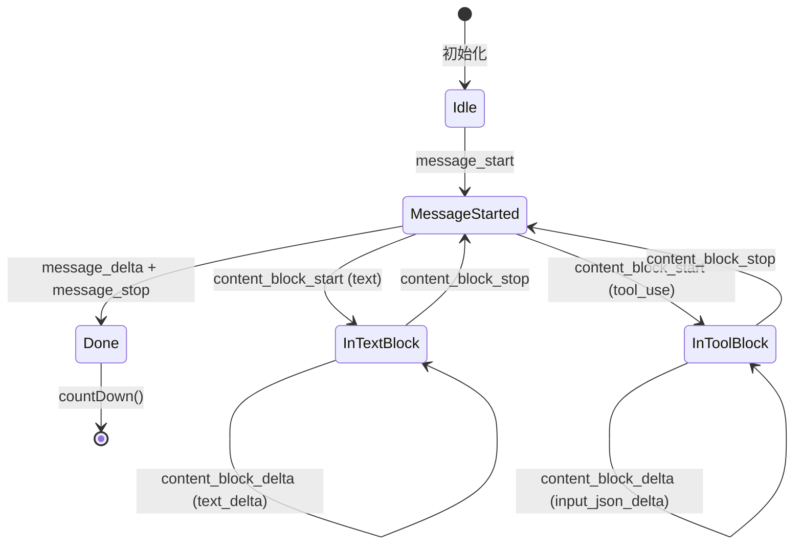
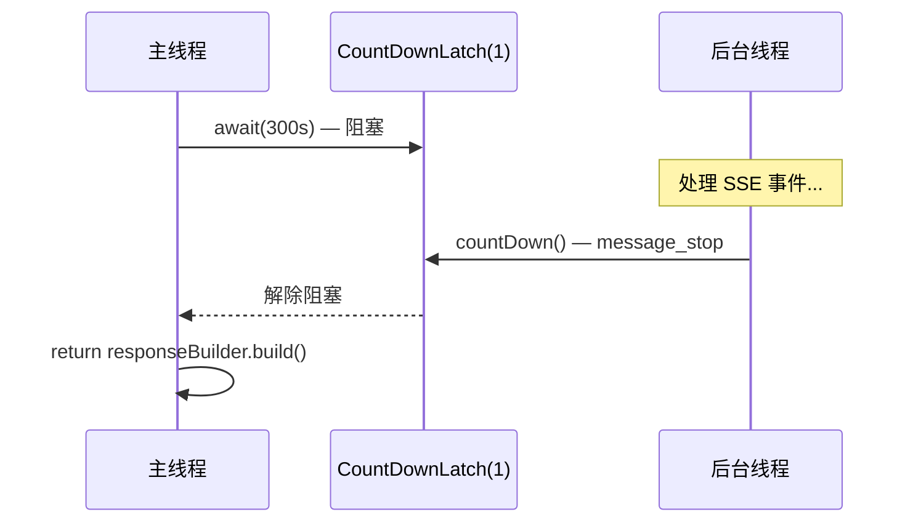

# SSE 流式组装

`StreamAssembler` 是一个**状态机**，负责将 SSE 事件流逐个处理并组装成完整的 `ApiResponse` 对象。

## 源文件

📄 `claude-code-java/src/main/java/com/claudecode/api/StreamAssembler.java`（约 377 行）

## 它解决什么问题？

Claude API 的流式响应不是一次性返回的 JSON，而是一系列离散的 SSE 事件。StreamAssembler 的任务就是**把这些碎片拼回完整的响应**。

```
输入（SSE 事件流）:
  message_start → content_block_start → delta → delta → ... → content_block_stop → message_delta → message_stop

输出（完整对象）:
  ApiResponse { id, model, content: [TextBlock, ToolUseBlock], stopReason, usage }
```

## 内部状态

```java
public class StreamAssembler extends EventSourceListener {
    // 构建中的响应
    private final ApiResponse.Builder responseBuilder;

    // 当前正在处理的 block 状态
    private String currentBlockType;        // "text" 或 "tool_use"
    private StringBuilder textBuffer;        // 文本累积
    private StringBuilder toolInputBuffer;   // JSON 片段累积
    private String currentToolId;
    private String currentToolName;

    // 同步控制
    private CountDownLatch completionLatch;  // 等待流完成
    private volatile String error;           // 错误信息
}
```

## 事件处理流程



## 六种事件的处理

### 1. message_start — 响应开始

```java
private void handleMessageStart(String data) throws Exception {
    JsonNode message = mapper.readTree(data).get("message");
    responseBuilder.id(message.get("id").asText());
    responseBuilder.model(message.get("model").asText());
    responseBuilder.role(message.get("role").asText());
    // 提取 input_tokens（仅在此事件中出现）
    inputTokens = message.get("usage").get("input_tokens").asInt();
}
```

### 2. content_block_start — 新块开始

```java
private void handleContentBlockStart(String data) throws Exception {
    JsonNode contentBlock = mapper.readTree(data).get("content_block");
    currentBlockType = contentBlock.get("type").asText();

    if ("text".equals(currentBlockType)) {
        textBuffer.setLength(0);          // 重置文本缓冲区
    } else if ("tool_use".equals(currentBlockType)) {
        currentToolId = contentBlock.get("id").asText();
        currentToolName = contentBlock.get("name").asText();
        toolInputBuffer.setLength(0);     // 重置 JSON 缓冲区
    }
}
```

根据 block 类型初始化不同的缓冲区。

### 3. content_block_delta — 增量数据

```java
private void handleContentBlockDelta(String data) throws Exception {
    JsonNode delta = mapper.readTree(data).get("delta");
    String deltaType = delta.get("type").asText();

    if ("text_delta".equals(deltaType)) {
        String text = delta.get("text").asText();
        if (onTextDelta != null) {
            onTextDelta.accept(text);     // ← 实时回调！用户立刻看到文字
        }
        textBuffer.append(text);          // 同时累积

    } else if ("input_json_delta".equals(deltaType)) {
        String partialJson = delta.get("partial_json").asText();
        toolInputBuffer.append(partialJson);  // 只累积，不解析！
    }
}
```

::: danger 关键规则
**text_delta**：收到就立刻回调输出（用户实时看到 "打字" 效果）

**input_json_delta**：只累积到缓冲区，**绝对不能**尝试解析！因为它是不完整的 JSON 片段。
:::

### 4. content_block_stop — 块结束

```java
private void handleContentBlockStop() throws Exception {
    ContentBlock block;

    if ("text".equals(currentBlockType)) {
        block = new TextBlock(textBuffer.toString());

    } else if ("tool_use".equals(currentBlockType)) {
        // 现在 JSON 是完整的，可以安全解析了
        String jsonStr = toolInputBuffer.toString();
        Map<String, Object> input = jsonStr.isEmpty()
            ? new HashMap<>()
            : mapper.readValue(jsonStr, Map.class);
        block = new ToolUseBlock(currentToolId, currentToolName, input);

    } else {
        return;  // 未知类型，跳过（前向兼容）
    }

    responseBuilder.addContentBlock(block);

    // 清空状态，准备下一个 block
    currentBlockType = null;
    textBuffer.setLength(0);
    toolInputBuffer.setLength(0);
}
```

这是 JSON 片段 **唯一可以安全解析** 的时机。

### 5. message_delta — 消息元信息

```java
private void handleMessageDelta(String data) throws Exception {
    JsonNode root = mapper.readTree(data);
    JsonNode delta = root.get("delta");
    if (delta.has("stop_reason")) {
        responseBuilder.stopReason(delta.get("stop_reason").asText());
    }
    // output_tokens 统计
    JsonNode usage = root.get("usage");
    if (usage != null) {
        int outputTokens = usage.get("output_tokens").asInt();
        responseBuilder.usage(new ApiResponse.Usage(inputTokens, outputTokens));
    }
}
```

`stop_reason` 在这里被提取 —— 它决定了 AgentLoop 的下一步行为。

### 6. message_stop — 流结束

```java
case "message_stop":
    completionLatch.countDown();  // 释放等待锁！
    break;
```

一行代码，但至关重要 —— 它释放了主线程的阻塞。

## CountDownLatch 同步机制

```java
// 主线程（ClaudeApiClient.sendMessageStream）
public ApiResponse getResponse(long timeoutSeconds) throws Exception {
    boolean completed = completionLatch.await(timeoutSeconds, TimeUnit.SECONDS);
    if (!completed) {
        throw new IOException("SSE stream timed out");
    }
    if (error != null) {
        throw new IOException(error);
    }
    return responseBuilder.build();
}
```



## 错误处理

```java
@Override
public void onFailure(EventSource eventSource, Throwable t, Response response) {
    error = "SSE connection failed: " + (t != null ? t.getMessage() : "HTTP " + response.code());
    if (response != null) {
        response.close();    // 防止资源泄漏
    }
    completionLatch.countDown();  // 即使出错也要释放锁！
}
```

::: warning
`onFailure` 中必须调用 `countDown()`，否则主线程会一直阻塞直到超时。
:::

## 思考题

1. 如果 SSE 流在 `content_block_delta` 中间断开，`textBuffer` 中的内容会怎样？
2. 为什么 `onTextDelta` 回调要在收到 delta 时立刻调用，而不是等 `content_block_stop` 时才输出？
3. 如果 Claude API 新增了 `"type": "image"` 类型的 block，当前代码会怎么处理？
4. `error` 字段为什么要用 `volatile` 修饰？

## 下一步

SSE 组装完成后，消息被存入 [对话历史与上下文管理](/core-code/conversation) 中。
