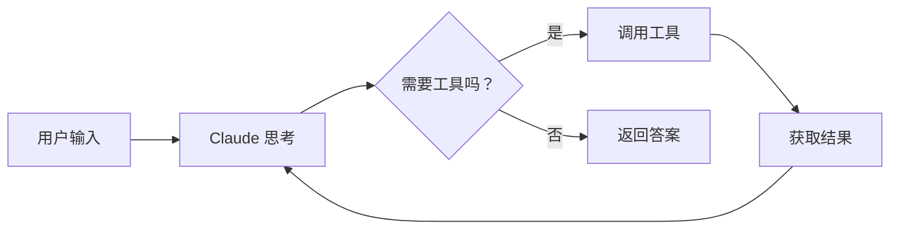

# 项目简介

## 什么是 claude-code-java？

**claude-code-java** 是一个用纯 Java 实现的 AI 编程助手命令行工具。它通过调用 Claude API，让大语言模型（LLM）能够**自主使用工具**来完成编程任务 —— 读取文件、执行命令、搜索代码、编辑代码。

简单来说，它就是一个 Java 版的 [Claude Code](https://docs.anthropic.com/en/docs/claude-code)。

```
你：帮我看看 pom.xml 里用了哪些依赖

Claude：好的，让我读取 pom.xml 文件。
        [调用 ReadFileTool 读取 pom.xml]

        这个项目使用了以下依赖：
        - OkHttp 4.12.0（HTTP 客户端）
        - Jackson 2.17.0（JSON 处理）
        - JLine 3.25.0（终端交互）
        - JUnit 5（单元测试）
```

## 它和普通聊天机器人有什么不同？

| 特性 | 普通聊天机器人 | claude-code-java (Agent) |
|------|-------------|------------------------|
| 交互模式 | 一问一答 | 多轮自主循环 |
| 能力范围 | 只能生成文本 | 可以读写文件、执行命令 |
| 任务复杂度 | 单步任务 | 多步骤复杂任务 |
| 决策能力 | 无 | 根据结果自主决定下一步 |

核心区别在于 **Agent Loop**（思考-行动循环）：



Claude 不是一次性给出答案，而是像人一样 **"思考 → 行动 → 观察 → 再思考"**，直到任务完成。

## 项目技术栈

| 技术 | 用途 | 版本 |
|------|------|------|
| **Java** | 主语言 | 11+ |
| **OkHttp** | HTTP 客户端 + SSE 流式处理 | 4.12.0 |
| **Jackson** | JSON 序列化/反序列化 | 2.17.0 |
| **JLine3** | 终端行编辑、历史记录 | 3.25.0 |
| **JUnit 5** | 单元测试 | 5.10.0 |
| **Maven** | 构建工具 | 3.6+ |

## 项目核心数字

- **40+ 个 Java 源文件**
- **8 个包**（模块）
- **7 个内置工具**（含 SkillTool）
- **支持 MCP 外部工具扩展**
- **Skill 系统**（Inline + Fork 两种执行模式）
- **约 5000 行核心代码**

## 学习这个项目你能收获什么？

### 1. AI Agent 架构设计
理解 Agent Loop 模式是如何驱动 LLM 自主完成复杂任务的。这是当前 AI 应用最核心的架构模式。

### 2. 流式 API 集成
学会如何用 Java 对接 Claude Messages API，特别是 SSE（Server-Sent Events）流式响应的处理 —— 让用户实时看到 AI "打字"。

### 3. 可扩展的工具系统
理解 "接口 → 实现 → 注册表" 的经典可扩展架构。只需实现一个 `Tool` 接口，就能给 AI 添加新能力。

### 4. 安全设计理念
学习 Human-in-the-loop（人在回路中）的权限管理模式 —— 如何在赋予 AI 能力的同时保障安全。

### 5. 完整的工程实践
从启动入口到终端渲染，从 HTTP 通信到进程管理，这是一个 "麻雀虽小，五脏俱全" 的完整项目。

## 目标读者

本文档面向 **具备 Java 基础的初中级开发者**：

- 熟悉 Java 核心语法（类、接口、集合框架）
- 了解 Maven 项目结构
- 了解 HTTP 基本概念
- **不需要**有 AI 或 LLM 的使用经验

## 下一步

准备好了吗？让我们从 [快速开始](/guide/quick-start) 开始，把项目跑起来！
