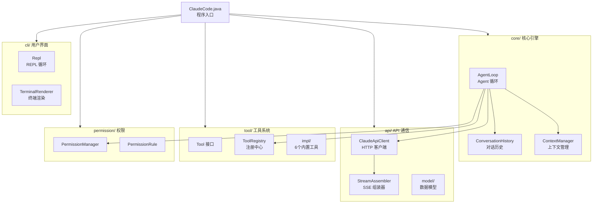

# 项目结构

## 目录总览

```
claude-code-java/
├── pom.xml                          # Maven 构建配置
├── src/
│   ├── main/java/com/claudecode/
│   │   ├── ClaudeCode.java          # 🚀 程序入口
│   │   │
│   │   ├── core/                    # 🧠 核心引擎
│   │   │   ├── AgentLoop.java       #    Agent 循环（最核心的类）
│   │   │   ├── ConversationHistory.java  #    对话历史管理
│   │   │   └── ContextManager.java  #    上下文窗口管理
│   │   │
│   │   ├── api/                     # 🌐 API 通信层
│   │   │   ├── ClaudeApiClient.java #    HTTP 客户端
│   │   │   ├── StreamAssembler.java #    SSE 流式组装器
│   │   │   └── model/              #    数据模型
│   │   │       ├── ApiRequest.java
│   │   │       ├── ApiResponse.java
│   │   │       ├── Message.java
│   │   │       ├── ContentBlock.java
│   │   │       ├── TextBlock.java
│   │   │       ├── ToolUseBlock.java
│   │   │       ├── ToolResultBlock.java
│   │   │       └── ToolDefinition.java
│   │   │
│   │   ├── tool/                    # 🔧 工具系统
│   │   │   ├── Tool.java           #    工具接口（所有工具的契约）
│   │   │   ├── ToolRegistry.java   #    工具注册中心
│   │   │   ├── ToolResult.java     #    工具执行结果
│   │   │   └── impl/              #    6 个内置工具实现
│   │   │       ├── BashTool.java
│   │   │       ├── ReadFileTool.java
│   │   │       ├── WriteFileTool.java
│   │   │       ├── EditFileTool.java
│   │   │       ├── GlobTool.java
│   │   │       └── GrepTool.java
│   │   │
│   │   ├── permission/             # 🔐 权限管理
│   │   │   ├── PermissionManager.java  #    权限评估 + 用户审批
│   │   │   └── PermissionRule.java #    权限规则 + 通配符匹配
│   │   │
│   │   └── cli/                    # 💻 用户界面
│   │       ├── Repl.java           #    交互式命令行循环
│   │       └── TerminalRenderer.java   #    终端渲染（颜色、格式）
│   │
│   └── test/                       # 🧪 单元测试
│       └── java/com/claudecode/
│           └── ...
```

## 六大模块

整个项目按职责划分为 6 个包，每个包专注于一个领域：



## 模块职责速查

| 模块 | 核心类 | 一句话职责 |
|------|--------|-----------|
| **入口** | `ClaudeCode` | 解析参数，初始化组件，启动应用 |
| **core/** | `AgentLoop` | 驱动 "思考-行动" 循环，是系统心脏 |
| **core/** | `ConversationHistory` | 维护 user/assistant 严格交替的消息列表 |
| **core/** | `ContextManager` | 监控 token 用量，执行上下文压缩 |
| **api/** | `ClaudeApiClient` | 封装 HTTP 通信，支持流式和非流式调用 |
| **api/** | `StreamAssembler` | 处理 SSE 事件流，组装完整的 API 响应 |
| **api/model/** | 7 个数据类 | Claude API 的请求/响应/消息/内容块模型 |
| **tool/** | `Tool` 接口 | 所有工具的统一契约（5 个方法） |
| **tool/** | `ToolRegistry` | 工具的注册、查找、执行的统一入口 |
| **tool/impl/** | 6 个工具类 | Bash/Read/Write/Edit/Glob/Grep 的具体实现 |
| **permission/** | `PermissionManager` | 权限评估（ALLOW/DENY/ASK）+ 用户审批 |
| **permission/** | `PermissionRule` | 权限规则定义 + 通配符匹配算法 |
| **cli/** | `Repl` | 交互式命令行循环（JLine3 驱动） |
| **cli/** | `TerminalRenderer` | 统一的终端输出渲染（颜色、格式化） |

## 依赖关系原则

这个项目的模块依赖遵循**单向依赖**原则，没有循环依赖：

- `ClaudeCode`（入口）→ 依赖所有模块（负责组装）
- `AgentLoop`（核心）→ 依赖 api, tool, permission（驱动协调）
- `ClaudeApiClient` → 依赖 model（发送/接收数据）
- `ToolRegistry` → 依赖 Tool 接口和 impl（管理工具）
- `PermissionManager` → 依赖 PermissionRule（评估规则）
- `Repl` → 依赖 AgentLoop（委托处理）

::: tip 设计要点
注意 `Repl` 不直接依赖 `ClaudeApiClient` 或 `ToolRegistry`，它只通过 `AgentLoop` 间接使用这些组件。这就是**门面模式（Facade）** 的体现 —— `AgentLoop` 是核心引擎的统一入口。
:::

## 下一步

了解了项目结构后，让我们进入 [整体架构](/architecture/overview)，从更高的视角理解各模块如何协作。
