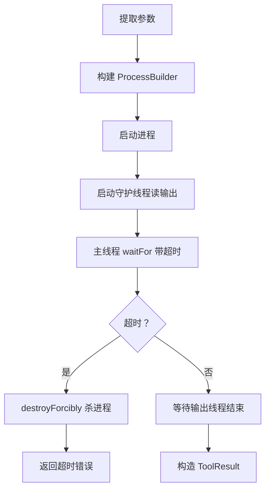

# BashTool

`BashTool` 是所有工具中最强大的，也是最危险的 —— 它能执行任意 Shell 命令。

## 源文件

📄 `claude-code-java/src/main/java/com/claudecode/tool/impl/BashTool.java`

## 工具定义

| 属性 | 值 |
|------|-----|
| name | `Bash` |
| requiresPermission | `true` |
| 参数 | `command`(必填), `timeout`(可选, 默认120秒) |

## 执行流程



## 核心实现解读

### 进程构建

```java
ProcessBuilder pb = new ProcessBuilder("bash", "-c", command);
pb.directory(new java.io.File(workingDirectory));
pb.redirectErrorStream(true);  // stderr 合并到 stdout
```

- `bash -c`：支持管道 `|`、重定向 `>`、变量展开 `$HOME` 等 Shell 语法
- `redirectErrorStream(true)`：stderr 和 stdout 合并，一次读取获得所有输出

### 守护线程读输出（关键设计）

```java
StringBuilder output = new StringBuilder();
Thread outputReader = new Thread(() -> {
    try (BufferedReader reader = new BufferedReader(
            new InputStreamReader(process.getInputStream()))) {
        String line;
        while ((line = reader.readLine()) != null) {
            synchronized (output) {
                output.append(line).append("\n");
                if (output.length() > MAX_OUTPUT_LENGTH) {  // 100KB
                    output.append("... (output truncated)");
                    break;
                }
            }
        }
    } catch (IOException e) { /* 正常退出路径 */ }
});
outputReader.setDaemon(true);
outputReader.start();
```

::: danger 为什么必须用单独的线程？
如果在主线程同步 `readLine()`，它会阻塞直到进程结束。但如果进程的输出缓冲区满了，进程会暂停等待缓冲区被读取 —— **死锁**！

正确方式：守护线程持续读取清空缓冲区，主线程用 `waitFor(timeout)` 控制超时。
:::

### 超时控制

```java
boolean finished = process.waitFor(timeout, TimeUnit.MILLISECONDS);
if (!finished) {
    process.destroyForcibly();  // 强制杀掉
    return ToolResult.error("Command timed out after " + timeout + "ms");
}
outputReader.join(3000);  // 等输出线程读完剩余数据
```

### 退出码处理

```java
int exitCode = process.exitValue();
if (exitCode != 0) {
    result += "\nExit code: " + exitCode;
}
return ToolResult.success(result);  // 注意：不是 error！
```

::: tip 为什么退出码非零不返回 error？
很多正常场景退出码也非零。比如 `grep` 没找到匹配时返回 1，`diff` 发现差异时返回 1。把退出码附上，让 LLM 自行判断是否是真正的错误。
:::

## 安全保护

| 保护机制 | 说明 |
|---------|------|
| 权限审批 | `requiresPermission = true`，每次执行前用户确认 |
| 超时限制 | 默认 120 秒，防止命令挂起 |
| 输出截断 | 100KB 上限，防止撑爆上下文 |
| 守护线程 | `setDaemon(true)`，主线程退出自动清理 |

## 思考题

1. `outputReader.setDaemon(true)` 的作用是什么？去掉会怎样？
2. 为什么用 `synchronized(output)` 而不是 `StringBuffer`？
3. 如果要支持实时输出（命令执行时逐行显示），你会怎么改？
