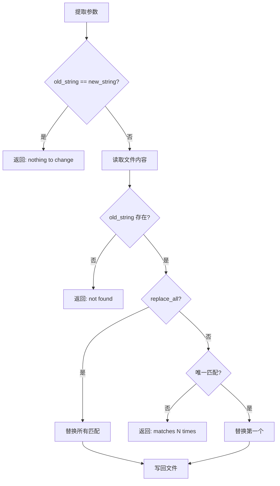

# EditFileTool

`EditFileTool` 是 Claude 修改代码的主要方式。它通过**精确字符串替换**来编辑文件，比全量覆写更安全。

## 源文件

📄 `claude-code-java/src/main/java/com/claudecode/tool/impl/EditFileTool.java`

## 工具定义

| 属性 | 值 |
|------|-----|
| name | `Edit` |
| requiresPermission | `true` |
| 参数 | `file_path`(必填), `old_string`(必填), `new_string`(必填), `replace_all`(可选, 默认false) |

## 核心逻辑



## 关键设计：唯一性检查

默认模式下，`old_string` 必须在文件中**唯一匹配**：

```java
if (!replaceAll) {
    int secondIdx = content.indexOf(oldString, firstIdx + 1);
    if (secondIdx >= 0) {
        int count = /* 计算出现次数 */;
        return ToolResult.error(
            "old_string matches " + count + " times. "
            + "Provide more surrounding context to make it unique, "
            + "or set replace_all=true.");
    }
}
```

::: tip 为什么要求唯一？
想象 Claude 想把 `return null;` 替换为 `return Optional.empty();`。如果文件中有 10 处 `return null;`，你肯定不希望它全部替换 —— 只有特定位置的才需要改。

唯一性检查迫使 Claude 提供**更多上下文**（比如包含周围的代码行），精确定位到目标位置。
:::

### 替换方式

```java
if (replaceAll) {
    // 替换所有 — 用 String.replace（字面量替换，不是正则）
    newContent = content.replace(oldString, newString);
} else {
    // 替换第一个 — 手动拼接（避免正则特殊字符问题）
    newContent = content.substring(0, firstIdx)
        + newString
        + content.substring(firstIdx + oldString.length());
}
```

::: warning 为什么不用 replaceFirst？
`String.replaceFirst()` 接受正则表达式。如果 `old_string` 中包含 `.`、`*`、`(` 等字符，会被当作正则元字符，导致意外行为。手动拼接字符串是最安全的字面量替换方式。
:::

## 安全校验清单

| 检查项 | 不通过时返回 |
|--------|------------|
| file_path 为空 | `error("Parameter 'file_path' is required")` |
| old_string 为空 | `error("Parameter 'old_string' is required")` |
| new_string 为空 | `error("Parameter 'new_string' is required")` |
| old == new | `error("old_string and new_string are identical")` |
| 文件不存在 | `error("File not found")` |
| old_string 找不到 | `error("old_string not found in file")` |
| 多处匹配且非 replace_all | `error("matches N times")` |

## Edit vs Write

| 特性 | Edit | Write |
|------|------|-------|
| 修改范围 | 局部（只改匹配的部分） | 全量（覆盖整个文件） |
| 安全性 | 高（不影响其他内容） | 低（可能丢失内容） |
| 适用场景 | 修改现有代码 | 创建新文件 |
| LLM 使用频率 | 最高 | 较低 |

## 思考题

1. 如果 `old_string` 跨越多行（包含换行符），当前实现能正确处理吗？
2. 为什么这个工具使用 `Files.readString` 而不像 ReadFileTool 那样用 BufferedReader？
3. 如果要支持"在第 N 行之后插入"的功能，你会怎么扩展？
