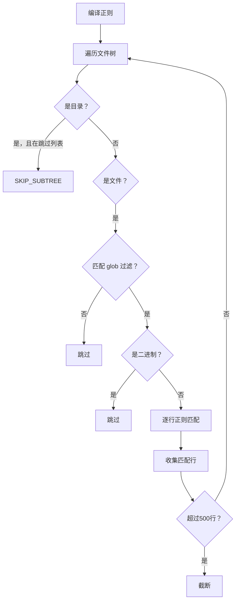

# GrepTool

`GrepTool` 使用正则表达式搜索文件内容，是 Claude 在代码中查找特定模式的主要工具。

## 工具定义

| 属性 | 值 |
|------|-----|
| name | `Grep` |
| requiresPermission | `false`（只读） |
| 参数 | `pattern`(必填, 正则表达式), `path`(可选), `glob`(可选, 文件过滤) |

## 功能特点

| 特性 | 说明 |
|------|------|
| 正则支持 | 完整的 Java 正则语法 |
| 文件过滤 | 通过 glob 参数限制搜索范围 |
| 智能跳过 | 跳过 `.git`、`node_modules` 等目录 |
| 二进制检测 | 跳过二进制文件 |
| 结果限制 | 最多 500 行匹配结果 |

## 核心实现流程



## 输出格式

```
/path/to/AgentLoop.java:142: public String run(String userInput) throws Exception {
/path/to/AgentLoop.java:147: while (turns < MAX_TURNS) {
/path/to/Repl.java:122: public void start() {
```

每行格式：`文件路径:行号: 匹配内容`

## Grep vs Glob

| 场景 | 使用工具 |
|------|---------|
| 找文件在哪里 | Glob（按文件名搜索） |
| 找代码在哪里 | **Grep**（按内容搜索） |
| 找所有 Java 文件 | Glob: `**/*.java` |
| 找所有 `TODO` 注释 | **Grep**: `TODO` |
| 找 `AgentLoop` 类的定义 | **Grep**: `class AgentLoop` |

## 安全保护

- **跳过二进制文件**：检测文件前几个字节是否包含 null 字符（0x00），如果包含则视为二进制
- **跳过大文件**：超过一定大小的文件不搜索，避免耗时过长
- **结果截断**：最多 500 行匹配结果，防止输出过大
- **跳过无关目录**：与 GlobTool 共用 `SKIP_DIRS` 列表

## 使用示例

Claude 常见的搜索模式：

```
// 查找类定义
Grep: pattern="class AgentLoop", glob="*.java"

// 查找方法调用
Grep: pattern="sendMessageStream", glob="*.java"

// 查找 TODO 注释
Grep: pattern="TODO|FIXME"

// 查找导入语句
Grep: pattern="import.*okhttp", glob="*.java"
```

## 思考题

1. 为什么 GrepTool 选择 Java 内置正则而不是调用系统的 `grep` 命令？
2. 如何判断一个文件是二进制文件？当前方案有什么局限？
3. 如果要支持搜索结果的上下文显示（显示匹配行的前后 N 行），你会怎么实现？

## 工具系统总结

至此，6 个内置工具全部讲解完毕：

| 工具 | 一句话 | 关键技术点 |
|------|--------|-----------|
| **Bash** | 执行 Shell 命令 | 守护线程、超时控制、输出截断 |
| **Read** | 读取文件内容 | BufferedReader、cat -n 格式、部分读取 |
| **Edit** | 精确字符串替换 | 唯一性检查、字面量替换（非正则） |
| **Write** | 创建/覆写文件 | 自动创建父目录 |
| **Glob** | 文件名搜索 | PathMatcher、修改时间排序、跳过目录 |
| **Grep** | 内容正则搜索 | 正则编译、二进制检测、glob 过滤 |

它们共同构成了 Claude 的 "双手"，让它能够在文件系统中自由操作。

## 动手实战

学完所有内容后，试试这些实战练习：

1. **入门**：实现一个 `ListDirectoryTool`，列出指定目录下的文件
2. **中级**：实现一个 `HttpTool`，发送 HTTP GET/POST 请求
3. **进阶**：实现一个 `DiffTool`，对比两个文件的差异

每个练习只需要：
1. 创建一个新的类实现 `Tool` 接口
2. 在 `ToolRegistry.registerBuiltinTools()` 中注册
3. 不需要修改任何其他代码
