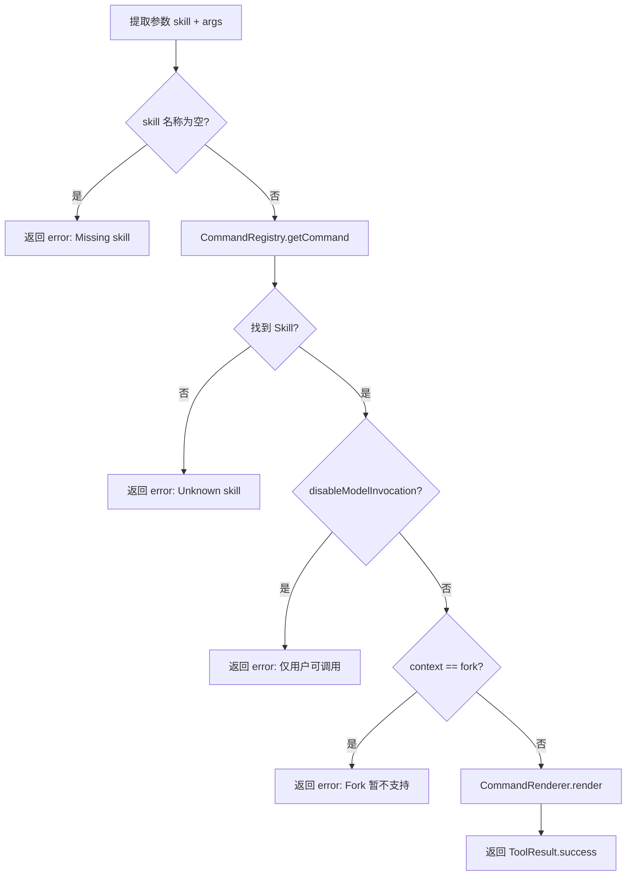

# SkillTool

`SkillTool` 是 Skill 系统与 Tool 系统之间的桥梁 —— 没有它，LLM 就无法触发任何 Skill。

## 源文件

📄 `claude-code-java/src/main/java/com/claudecode/tool/impl/SkillTool.java`

## 工具定义

| 属性 | 值 |
|------|-----|
| name | `Skill` |
| requiresPermission | `false` |
| 参数 | `skill`(必填, Skill名称), `args`(可选, 传入参数) |

## 为什么需要 SkillTool？

LLM 只能通过 `tool_use`（工具调用）与外部世界交互。但 Skill 是提示词，不是工具。

问题：**LLM 怎么触发 Skill？**

答案：SkillTool 充当「翻译官」——

```
LLM 发出:  tool_use { name: "Skill", input: { skill: "simplify" } }
    │
    ▼
SkillTool.execute()
    │
    ├── 1. 在 CommandRegistry 中查找 "simplify"
    ├── 2. 通过 CommandRenderer 渲染 SKILL.md 内容
    └── 3. 返回渲染后的提示词作为 ToolResult
              │
              ▼
AgentLoop 将提示词注入对话 → LLM 按指令继续执行
```

## 执行流程



## 核心实现解读

### 参数提取与校验

```java
String skillName = (String) input.get("skill");
if (skillName == null || skillName.trim().isEmpty()) {
    return ToolResult.error("Missing required parameter: 'skill'.");
}

String args = "";
if (input.containsKey("args") && input.get("args") != null) {
    args = String.valueOf(input.get("args")).trim();
}
```

两个参数：
- `skill`（必填）：要调用的 Skill 名称
- `args`（可选）：传给 Skill 的参数，会替换 `$ARGUMENTS`

### 查找与权限验证

```java
// 在 CommandRegistry 中查找
PromptCommand command = commandRegistry.getCommand(skillName);
if (command == null) {
    return ToolResult.error("Unknown skill: '" + skillName + "'.");
}

// 检查是否禁止 LLM 自动调用
if (command.isDisableModelInvocation()) {
    return ToolResult.error("Skill '" + skillName + "' can only be invoked by the user.");
}
```

::: tip disableModelInvocation 是什么场景？
有些 Skill 比较「危险」（比如部署到生产环境），你不希望 LLM 在不合适的时候自动触发。设置 `disable-model-invocation: true` 后，只有用户通过 `/deploy` 显式输入才能触发。
:::

### 渲染与返回

```java
String rendered = renderer.render(command, args);  // ← 变量替换 + Shell 预处理
return ToolResult.success(rendered);               // ← 返回渲染后的提示词
```

渲染过程由 `CommandRenderer` 完成，包含两个阶段：
1. **Shell 预处理**：执行 `` !`command` `` 语法，将命令输出内联替换
2. **变量替换**：`$ARGUMENTS` → 用户传入的参数

### AgentLoop 中的特殊处理

SkillTool 返回的结果不是普通的工具输出 —— AgentLoop 会给它加上 `<command-name>` 标签：

```java
// AgentLoop.executeTools() 中
if ("Skill".equals(toolName) && !result.isError()) {
    String skillName = String.valueOf(toolUse.getInput().get("skill"));
    String wrapped = "<command-name>" + skillName + "</command-name>\n"
            + result.getContent();
    result = ToolResult.success(wrapped);
}
```

::: warning 为什么需要 &lt;command-name&gt; 标签？
这个标签告诉 LLM 两件事：
1. 这段内容是一个 **Skill 指令**，不是普通的工具输出数据
2. 这个 Skill 已经加载了，**不要再重复调用 SkillTool**（防止死循环）
:::

## 与其他工具的对比

| 对比维度 | BashTool | ReadFileTool | SkillTool |
|---------|----------|-------------|-----------|
| 返回的是 | 命令输出 | 文件内容 | **提示词** |
| LLM 拿到后 | 分析数据 | 分析代码 | **按指令执行** |
| 有副作用吗 | 有(执行命令) | 无(只读) | 无(只返回文本) |
| 需要权限吗 | 是 | 否 | 否 |

SkillTool 是唯一一个「返回值会改变 LLM 行为方式」的工具 —— 其他工具返回数据供 LLM 分析，而 SkillTool 返回的是 LLM 要遵循的指令。

## 完整交互示例

用户输入 `/simplify src/main`：

```
第 1 步：Repl 捕获 /simplify，转发给 AgentLoop

第 2 步：LLM 看到消息，识别出要调用 Skill
→ tool_use: { name: "Skill", input: { skill: "simplify", args: "src/main" } }

第 3 步：SkillTool.execute() 执行
→ CommandRegistry.getCommand("simplify") → 找到 PromptCommand
→ CommandRenderer.render(command, "src/main")
→ 将 $ARGUMENTS 替换为 "src/main"
→ 返回: "你是代码审查专家，请检查 src/main 中的代码..."

第 4 步：AgentLoop 包裹标签
→ "<command-name>simplify</command-name>\n你是代码审查专家..."

第 5 步：LLM 看到 Skill 指令，按照指令开始审查
→ tool_use: Read { file_path: "src/main/..." }
→ ... 逐个文件审查 ...
→ 最终输出审查报告
```

## 思考题

1. SkillTool 的 `requiresPermission` 返回 `false`，但 Skill 中的 Shell 预处理（`` !`command` ``）会在本地执行命令。这是否是一个安全隐患？你会怎么解决？
2. 如果 LLM 在一次对话中连续调用同一个 Skill 两次，会发生什么？如何防止重复加载？
3. 当前 SkillTool 通过构造函数注入 CommandRegistry。如果要支持运行时动态添加 Skill（不重启），需要改哪些地方？

## 下一步

了解了 SkillTool 的工作原理后，让我们深入看看 [CommandRegistry 命令注册中心](/core-code/command-registry) 是如何管理所有 Skill 的。
